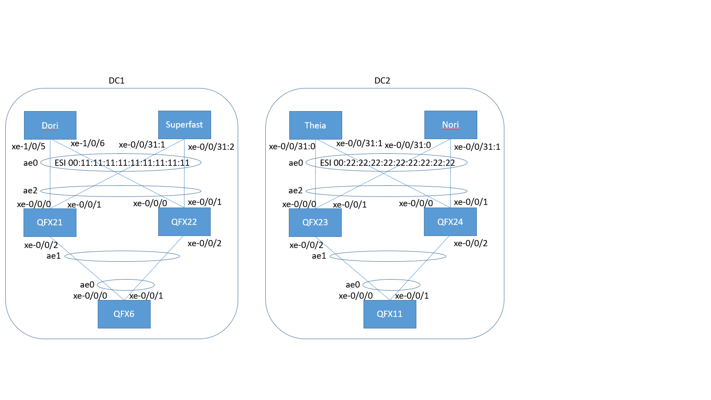

[](https://travis-ci.org/ksator/EVPN_DCI_automation)

### What to find in this repo: 
Network automation content with Ansible, Jinja, YAML, Python and Travis CI.  
- For a DCI demo using EVPN-VXLAN.  
- With network devices running Junos. Accross 2 differents DC.  

The setup is already up and running. So this automation content is not used to build the setup.  
This automation content is used to update the existing setup adding/removing/replacing/auditing vlans to the DCI configuration. It uses a declarative approach and enforces the desired state against the network.    

This repo covers also how to generate YAML variables (ready to be consumed by Jinja and Ansible) from a CSV file (source-controlled) using Python.  

It has also a Python script to locate a mac address (i.e that connects to all the devices to provide the interfaces associated with a learned MAC addresses). This script uses the Ansible inventory file to get the list of devices ip address.    

### Topology: 

There are 2 DC (DC1 and DC2).    

Dori, Superfast, Theia and Nori are QFX10000 devices.  
QFX21, QFX22, QFX23, QFX24, QFX6 and QFX11 are QFX5100 devices.  

EVPN-VXLAN runs on the QFX10k devices.  
L3 is done on the QFX10k devices.  
DCI (EVPN-VXLAN) is done on the QFX10000 devices.  

QFX21, QFX22, QFX23, QFX24, QFX6 and QFX11 do L2 only.  
QFX21 and 22 use MC-LAG. QFX23 and 24 use MC-LAG.    
QFX6 uses a LAG. QFX11 uses a LAG. 



### Repo structure 
- ansible playbooks are at the root of the repository.    
  - **pb.renderxxx.yml** playbooks render templates. They dont connect to junos devices
    - [pb.renderaddvlans.yml](https://github.com/ksator/EVPN_DCI_automation/blob/master/pb.renderaddvlans.yml) 
    - [pb.renderremovevlans.yml](https://github.com/ksator/EVPN_DCI_automation/blob/master/pb.renderremovevlans.yml)
    - [pb.renderreplacevlans.yml](https://github.com/ksator/EVPN_DCI_automation/blob/master/pb.renderreplacevlans.yml)
  - [**pb.rollback.yml**](https://github.com/ksator/EVPN_DCI_automation/blob/master/pb.rollback.yml) playbook performs a rollback on junos devices. 
  - [**pb.addvlans.yml**](https://github.com/ksator/EVPN_DCI_automation/blob/master/pb.renderaddvlans.yml) playbook configures the devices with new vlans
  - [**pb.removevlans.yml**](https://github.com/ksator/EVPN_DCI_automation/blob/master/pb.removevlans.yml) playbook removes existing vlans from devices
  - [**pb.check.vlans.yml**](https://github.com/ksator/EVPN_DCI_automation/blob/master/pb.check.vlans.yml) playbook checks if vlans are presents from devices operationnal states
  - [**pb.check.bgp.yml**](https://github.com/ksator/EVPN_DCI_automation//blob/master/pb.check.bgp.yml) playbook checks if BGP sessions are established  
  - [**pb.replacevlans.yml**](https://github.com/ksator/EVPN_DCI_automation/blob/master/pb.replacevlans.yml) playbook enforces the desired state on the devices (which is the best approach vs using [**pb.addvlans.yml**](https://github.com/ksator/EVPN_DCI_automation/blob/master/pb.renderaddvlans.yml) + [**pb.removevlans.yml**](https://github.com/ksator/EVPN_DCI_automation/blob/master/pb.removevlans.yml))
  - [**pb.get.junos.facts.yml**](https://github.com/ksator/EVPN_DCI_automation/blob/master/pb.get.junos.facts.yml) playbook gets the junos facts from the devices  

- ansible inventory file is [**hosts**](https://github.com/ksator/EVPN_DCI_automation/blob/master/hosts) file at the root of the repository.    

- ansible configuration file is [**ansible.cfg**](https://github.com/ksator/EVPN_DCI_automation/blob/master/ansible.cfg) at the root of the repository.   

- jinja templates are j2 files in the directory [**templates**](https://github.com/ksator/EVPN_DCI_automation/tree/master/templates). 
  - **10kxxx.j2** templates in the directory [**templates**](https://github.com/ksator/EVPN_DCI_automation/tree/master/templates) are QFX10k specifics templates to:
    - add new vlans: [10kaddvlans.j2](https://github.com/ksator/EVPN_DCI_automation/blob/master/templates/10kaddvlans.j2)
    - remove existing vlans: [10kremovevlans.j2](https://github.com/ksator/EVPN_DCI_automation/blob/master/templates/10kremovevlans.j2)
    - replace actual vlans configuration with the desirated state: [10kreplacevlans.j2](https://github.com/ksator/EVPN_DCI_automation/blob/master/templates/10kreplacevlans.j2)
  - **5kxxx.j2** templates in the directory [**templates**](https://github.com/ksator/EVPN_DCI_automation/tree/master/templates) are QFX5k specifics templates to:
    - add new vlans: [5kaddvlans.j2](https://github.com/ksator/EVPN_DCI_automation/blob/master/templates/5kaddvlans.j2)
    - remove existing vlans: [5kremovevlans.j2](https://github.com/ksator/EVPN_DCI_automation/blob/master/templates/5kremovevlans.j2)
    - replace actual vlans configuration with the desirated state: [5kreplacevlans.j2](https://github.com/ksator/EVPN_DCI_automation/blob/master/templates/5kreplacevlans.j2)

- variables are yml files under [**group_vars**](https://github.com/ksator/EVPN_DCI_automation/tree/master/group_vars/all) and [**host_vars**](https://github.com/ksator/EVPN_DCI_automation/tree/master/host_vars) directories.   
  - host specific variables are yml files under the directory [**host_vars**](https://github.com/ksator/EVPN_DCI_automation/tree/master/host_vars).   
  - group related variables are yml files under the directory [**group_vars**](https://github.com/ksator/EVPN_DCI_automation/tree/master/group_vars) 
  - [**generate_yml_vars.py**](https://github.com/ksator/EVPN_DCI_automation/blob/master/generate_yml_vars.py) generates yaml variables for Ansible from the [**CSV**](https://github.com/ksator/EVPN_DCI_automation/blob/master/vars.csv) file.  

- templates are rendered into the directory [**render**](https://github.com/ksator/EVPN_DCI_automation/tree/master/render)

- Junos configuration files are saved automatically before any change into the directory [**backup**](https://github.com/ksator/EVPN_DCI_automation/tree/master/backup)

- Junos configuration diffs from rollbacks done with ansible are in the directory [**rollback**](https://github.com/ksator/EVPN_DCI_automation/tree/master/rollback) 

- Python scripts are at the root of the repository  
  - [**findmac.py**](https://github.com/ksator/EVPN_DCI_automation/blob/master/findmac.py) locates a mac address accross the network.  
  - [**generate_yml_vars.py**](https://github.com/ksator/EVPN_DCI_automation/blob/master/generate_yml_vars.py) generates yaml variables for Ansible from the [**CSV**](https://github.com/ksator/EVPN_DCI_automation/blob/master/test.csv) file.  

- a [**CSV**](https://github.com/ksator/EVPN_DCI_automation/blob/master/vars.csv) file at the root of the repository  

- The CI configuration files [**.travis.yml**](https://github.com/ksator/EVPN_DCI_automation/blob/master/.travis.yml) and [**requirements.txt**](https://github.com/ksator/EVPN_DCI_automation/blob/master/requirements.txt) at the root of this repository 


### Continuous integration with Travis CI

The Ansible playbooks and Python scripts in  this repository are tested automatically by [**Travis CI**](https://travis-ci.org/ksator/EVPN_DCI_automation).  
Travis CI is notified by github at each git push and pull request events. This triggers new builds.  
The files [**.travis.yml**](https://github.com/ksator/EVPN_DCI_automation/blob/master/.travis.yml) and [**requirements.txt**](https://github.com/ksator/EVPN_DCI_automation/blob/master/requirements.txt) at the root of this repository are used for this.  
For ansible playbooks that doesnt interact with Junos devices, they are executed. If there is a syntax error, Travis will fail the build.      
The command ansible-playbook has a built in option to check only the playbook's syntax (--syntax-check). This is how Travis is testing the playbooks that interact with Junos. Travis CI doesnt actually connect to the devices. If there is a syntax error, Travis will fail the build.  
The same logic is applied to the python scripts.  

The last build status is: [](https://travis-ci.org/ksator/EVPN_DCI_automation)  
The details are available [here](https://travis-ci.org/ksator/EVPN_DCI_automation)  

### Slack integration:  
Github activities and Travis CI results are posted to a Slack channel:   
  

Ansible playbooks results are posted to a Slack channel:   


### How to use this repo 

#### Requirements 

##### Requirements on ubuntu 16.04:
```
sudo apt-get install -y python-dev libxml2-dev python-pip libxslt1-dev build-essential libssl-dev libffi-dev
sudo pip install jxmlease netaddr cryptography==1.2.1 junos-eznc pytest pytest-cov coveralls ansible==2.2.3
sudo ansible-galaxy --force install Juniper.junos 
 ```
 
##### Requirements on Junos: 
Enable netconf and make sure you can reach that port on the juniper device  from your laptop  
```
set system service netconf ssh
commit
```

#### get the remote repo content locally: 
```
git clone https://github.com/ksator/EVPN_DCI_automation.git 
```
```
cd EVPN_DCI_automation
sudo -s
```

#### search for a mac address accross the network
```
# python ./findmac.py 80:ac:ac:2f:00:d4

80:ac:ac:2f:00:d4 is not known by Superfast-QFX

80:ac:ac:2f:00:d4 is not known by Theia-QFX

80:ac:ac:2f:00:d4 is not known by Nori-QFX

80:ac:ac:2f:00:d4 is known by QFX5100-48S-6 via the list of interfaces ['ae0.0']

80:ac:ac:2f:00:d4 is known by QFX5100-48S3-11 via the list of interfaces ['ae0.0']

80:ac:ac:2f:00:d4 is known by QFX5100-48S3-21 via the list of interfaces ['ae2.0']

80:ac:ac:2f:00:d4 is not known by QFX5100-48S3-22

80:ac:ac:2f:00:d4 is known by QFX5100-48S3-23 via the list of interfaces ['ae2.0']

80:ac:ac:2f:00:d4 is not known by QFX5100-48S3-24

lookup done accross 10 devices.

```

#### execute this playbook to get the junos facts from the network devices
```
# ansible-playbook pb.get.junos.facts.yml

PLAY [create inventory directory] **********************************************

TASK [create inventory directory] **********************************************
ok: [localhost]

PLAY [Get Facts] ***************************************************************

TASK [remove host from inventory directory] ************************************
ok: [QFX6]
ok: [QFX11]
ok: [QFX21]
ok: [QFX22]
ok: [QFX23]
ok: [Superfast]
ok: [QFX24]
ok: [Dori]
ok: [Theia]
ok: [Nori]

TASK [Retrieve information from devices running Junos] *************************
ok: [QFX6]
ok: [QFX11]
ok: [QFX23]
ok: [QFX22]
ok: [QFX21]
fatal: [Dori]: FAILED! => {"changed": false, "failed": true, "msg": "unable to connect to 10.161.34.131: ConnectRefusedError(10.161.34.131)"}
ok: [QFX24]
ok: [Theia]
ok: [Superfast]
ok: [Nori]

TASK [Print some facts] ********************************************************
ok: [QFX21] => {
    "msg": "device QFX5100-48S3-21 is a QFX5100-48S-6Q running version 14.1X53-D45.3"
}
ok: [QFX11] => {
    "msg": "device QFX5100-48S3-11 is a QFX5100-48S-6Q running version 14.1X53-D45.3"
}
ok: [QFX6] => {
    "msg": "device QFX5100-48S-6 is a QFX5100-48S-6Q running version 14.1X53-D45.3"
}
ok: [QFX22] => {
    "msg": "device QFX5100-48S3-22 is a QFX5100-48S-6Q running version 14.1X53-D45.3"
}
ok: [QFX23] => {
    "msg": "device QFX5100-48S3-23 is a QFX5100-48S-6Q running version 14.1X53-D45.3"
}
ok: [QFX24] => {
    "msg": "device QFX5100-48S3-24 is a QFX5100-48S-6Q running version 14.1X53-D45.3"
}
ok: [Theia] => {
    "msg": "device Theia-QFX is a QFX10002-36Q running version 17.3R1-S1.5"
}
ok: [Superfast] => {
    "msg": "device Superfast-QFX is a QFX10002-36Q running version 17.3R1.10"
}
ok: [Nori] => {
    "msg": "device Nori-QFX is a QFX10002-36Q running version 17.3R1-S1.5"
}

NO MORE HOSTS LEFT *************************************************************
	to retry, use: --limit @/root/EVPN_DCI_automation/pb.get.junos.facts.retry

PLAY RECAP *********************************************************************
Dori                       : ok=1    changed=0    unreachable=0    failed=1   
Nori                       : ok=3    changed=0    unreachable=0    failed=0   
QFX11                      : ok=3    changed=0    unreachable=0    failed=0   
QFX21                      : ok=3    changed=0    unreachable=0    failed=0   
QFX22                      : ok=3    changed=0    unreachable=0    failed=0   
QFX23                      : ok=3    changed=0    unreachable=0    failed=0   
QFX24                      : ok=3    changed=0    unreachable=0    failed=0   
QFX6                       : ok=3    changed=0    unreachable=0    failed=0   
Superfast                  : ok=3    changed=0    unreachable=0    failed=0   
Theia                      : ok=3    changed=0    unreachable=0    failed=0   
localhost                  : ok=1    changed=0    unreachable=0    failed=0   
```
```
# ls inventory/
Dori-QFX-facts.json         QFX5100-48S3-23-facts.json
Nori-QFX-facts.json         QFX5100-48S3-24-facts.json
QFX5100-48S3-11-facts.json  QFX5100-48S-6-facts.json
QFX5100-48S3-21-facts.json  Superfast-QFX-facts.json
QFX5100-48S3-22-facts.json  Theia-QFX-facts.json
```

#### verify bgp session states are Established 
```
# ansible-playbook pb.check.bgp.yml 

PLAY [check bgp states] ********************************************************

TASK [check if ebgp neighbors are established] *********************************
ok: [Superfast] => (item={u'neighbor': u'10.1.1.11'})
ok: [Theia] => (item={u'neighbor': u'10.2.2.11'})
ok: [Nori] => (item={u'neighbor': u'10.2.2.9'})
failed: [Dori] (item={u'neighbor': u'10.1.1.9'}) => {"failed": true, "item": {"neighbor": "10.1.1.9"}, "msg": "unable to connect to 10.161.34.131: ConnectTimeoutError(10.161.34.131)"}

TASK [check if ibgp neighbors are established] *********************************
ok: [Theia] => (item={u'neighbor': u'100.3.3.2'})
ok: [Superfast] => (item={u'neighbor': u'100.3.3.2'})
ok: [Nori] => (item={u'neighbor': u'100.3.3.2'})

TASK [Send Slack notification] *************************************************
ok: [Superfast -> localhost]
ok: [Theia -> localhost]
ok: [Nori -> localhost]

NO MORE HOSTS LEFT *************************************************************
	to retry, use: --limit @/root/EVPN_DCI_automation/pb.check.bgp.retry

PLAY RECAP *********************************************************************
Dori                       : ok=0    changed=0    unreachable=0    failed=1   
Nori                       : ok=3    changed=0    unreachable=0    failed=0   
Superfast                  : ok=3    changed=0    unreachable=0    failed=0   
Theia                      : ok=3    changed=0    unreachable=0    failed=0   

```

#### generate yaml variables for ansible from a csv file

##### Edit the [csv file](https://github.com/ksator/EVPN_DCI_automation/blob/master/test.csv)  
```
nano vars.csv 
```
```
git diff vars.csv 
```
```
more vars.csv
Vlan-id,Subnet,virtual_mac,DC1,DC2
201,10.201.0.0/16,00:25:01:00:00:01,True,False
202,10.202.0.0/16,00:25:02:00:00:01,True,True
203,10.203.0.0/16,00:25:03:00:00:01,False,True
204,10.204.0.0/16,00:25:04:00:00:01,False,False
205,10.205.0.0/16,00:25:05:00:00:01,False,True
206,10.206.0.0/16,00:25:06:00:00:01,False,True
207,10.207.0.0/16,00:25:07:00:00:01,True,False
208,10.208.0.0/16,00:25:08:00:00:01,True,True
```
##### Execute [this python script](https://github.com/ksator/EVPN_DCI_automation/blob/master/generate_yml_vars.py)
```
python ./generate_yml_vars.py
```
##### check the new [variables](https://github.com/ksator/EVPN_DCI_automation/blob/master/README.md#variables)   
```
git diff group_vars/DC1/vlans.yml
```
```
git diff group_vars/DC2/vlans.yml
```
```
more group_vars/DC1/vlans.yml
vlanlist:
- id: 201
  name: VLAN201
  subnet: 10.201.0.0/16
  virtual_ip: 10.201.0.1
  virtual_mac: 00:25:01:00:00:01
  vni: 20201
- id: 202
  name: VLAN202
  subnet: 10.202.0.0/16
  virtual_ip: 10.202.0.1
  virtual_mac: 00:25:02:00:00:01
  vni: 20202
- id: 207
  name: VLAN207
  subnet: 10.207.0.0/16
  virtual_ip: 10.207.0.1
  virtual_mac: 00:25:07:00:00:01
  vni: 20207
- id: 208
  name: VLAN208
  subnet: 10.208.0.0/16
  virtual_ip: 10.208.0.1
  virtual_mac: 00:25:08:00:00:01
  vni: 20208
```
```
# more group_vars/DC2/vlans.yml
vlanlist:
- id: 202
  name: VLAN202
  subnet: 10.202.0.0/16
  virtual_ip: 10.202.0.1
  virtual_mac: 00:25:02:00:00:01
  vni: 20202
- id: 203
  name: VLAN203
  subnet: 10.203.0.0/16
  virtual_ip: 10.203.0.1
  virtual_mac: 00:25:03:00:00:01
  vni: 20203
- id: 205
  name: VLAN205
  subnet: 10.205.0.0/16
  virtual_ip: 10.205.0.1
  virtual_mac: 00:25:05:00:00:01
  vni: 20205
- id: 206
  name: VLAN206
  subnet: 10.206.0.0/16
  virtual_ip: 10.206.0.1
  virtual_mac: 00:25:06:00:00:01
  vni: 20206
- id: 208
  name: VLAN208
  subnet: 10.208.0.0/16
  virtual_ip: 10.208.0.1
  virtual_mac: 00:25:08:00:00:01
  vni: 20208

```
#### render the templates locally if you want to see the configuration files that are going to be generated: 

##### Generate the configuration that describes the desired state (best approach, declarative approach)
```
# ansible-playbook pb.renderreplacevlans.yml 

PLAY [create render directory] *************************************************

TASK [create render directory] *************************************************
ok: [localhost]

PLAY [render template for QFX10k] **********************************************

TASK [remove files from render directory] **************************************
changed: [Superfast]
changed: [Dori]
changed: [Nori]
changed: [Theia]

TASK [Render template for QFX10k] **********************************************
changed: [Theia]
changed: [Superfast]
changed: [Nori]
changed: [Dori]

PLAY [render template for QFX5k] ***********************************************

TASK [remove files from render directory] **************************************
changed: [QFX6]
changed: [QFX21]
changed: [QFX11]
changed: [QFX23]
changed: [QFX22]
changed: [QFX24]

TASK [Render template for QFX5k] ***********************************************
changed: [QFX23]
changed: [QFX11]
changed: [QFX21]
changed: [QFX22]
changed: [QFX6]
changed: [QFX24]

PLAY RECAP *********************************************************************
Dori                       : ok=2    changed=2    unreachable=0    failed=0   
Nori                       : ok=2    changed=2    unreachable=0    failed=0   
QFX11                      : ok=2    changed=2    unreachable=0    failed=0   
QFX21                      : ok=2    changed=2    unreachable=0    failed=0   
QFX22                      : ok=2    changed=2    unreachable=0    failed=0   
QFX23                      : ok=2    changed=2    unreachable=0    failed=0   
QFX24                      : ok=2    changed=2    unreachable=0    failed=0   
QFX6                       : ok=2    changed=2    unreachable=0    failed=0   
Superfast                  : ok=2    changed=2    unreachable=0    failed=0   
Theia                      : ok=2    changed=2    unreachable=0    failed=0   
localhost                  : ok=1    changed=0    unreachable=0    failed=0   
```
```
# ls render/*_replacevlans.conf
render/Dori_replacevlans.conf   render/QFX23_replacevlans.conf
render/Nori_replacevlans.conf   render/QFX24_replacevlans.conf
render/QFX11_replacevlans.conf  render/QFX6_replacevlans.conf
render/QFX21_replacevlans.conf  render/Superfast_replacevlans.conf
render/QFX22_replacevlans.conf  render/Theia_replacevlans.conf
```
```
# more render/Superfast_replacevlans.conf 
replace:
vlans {
    VLAN201 {
        vlan-id 201;
        l3-interface irb.201;
        vxlan {
            vni 20201;
        }
    }
    VLAN202 {
        vlan-id 202;
        l3-interface irb.202;
        vxlan {
            vni 20202;
        }
    }
    VLAN207 {
        vlan-id 207;
        l3-interface irb.207;
        vxlan {
            vni 20207;
        }
    }
    VLAN208 {
        vlan-id 208;
        l3-interface irb.208;
        vxlan {
            vni 20208;
        }
    }
    VLAN2000 {
        vlan-id 2000;
    }
}
interfaces {
    replace:
    irb {
        unit 201 {
            family inet {
                address 10.201.0.3/16 {
                    virtual-gateway-address 10.201.0.1;
                }
            }
            virtual-gateway-v4-mac 00:25:01:00:00:01;
        }
        unit 202 {
            family inet {
                address 10.202.0.3/16 {
                    virtual-gateway-address 10.202.0.1;
                }
            }
            virtual-gateway-v4-mac 00:25:02:00:00:01;
        }
        unit 207 {
            family inet {
                address 10.207.0.3/16 {
                    virtual-gateway-address 10.207.0.1;
                }
            }
            virtual-gateway-v4-mac 00:25:07:00:00:01;
        }
        unit 208 {
            family inet {
                address 10.208.0.3/16 {
                    virtual-gateway-address 10.208.0.1;
                }
            }
            virtual-gateway-v4-mac 00:25:08:00:00:01;
        }
    }
}
protocols {
    replace:
    pim {
        interface irb.201 {
            distributed-dr;
           }
        interface irb.202 {
            distributed-dr;
           }
        interface irb.207 {
            distributed-dr;
           }
        interface irb.208 {
            distributed-dr;
           }
        rp {
            static {
                address 100.1.1.254;
           }
        }
        interface all {
            mode sparse;
           }
        interface fxp0.0 {
           disable;
           }
        join-load-balance;
    }
    replace:
    igmp-snooping {
        vlan VLAN201 {
            proxy;
        }
        vlan VLAN202 {
            proxy;
        }
        vlan VLAN207 {
            proxy;
        }
        vlan VLAN208 {
            proxy;
        }
    }
}
```

##### Generate the configuration to delete vlans (not the ideal approach)  
```
# ansible-playbook pb.renderremovevlans.yml 

PLAY [create render directory] *************************************************

TASK [create render directory] *************************************************
ok: [localhost]

PLAY [render template for QFX10k] **********************************************

TASK [remove files from render directory] **************************************
changed: [Superfast]
changed: [Nori]
changed: [Dori]
changed: [Theia]

TASK [Render template for QFX10k] **********************************************
changed: [Superfast]
changed: [Dori]
changed: [Nori]
changed: [Theia]

PLAY [render template for QFX5k] ***********************************************

TASK [remove files from render directory] **************************************
changed: [QFX21]
changed: [QFX11]
changed: [QFX6]
changed: [QFX23]
changed: [QFX22]
changed: [QFX24]

TASK [Render template for QFX5k] ***********************************************
changed: [QFX6]
changed: [QFX22]
changed: [QFX11]
changed: [QFX23]
changed: [QFX21]
changed: [QFX24]

PLAY RECAP *********************************************************************
Dori                       : ok=2    changed=2    unreachable=0    failed=0   
Nori                       : ok=2    changed=2    unreachable=0    failed=0   
QFX11                      : ok=2    changed=2    unreachable=0    failed=0   
QFX21                      : ok=2    changed=2    unreachable=0    failed=0   
QFX22                      : ok=2    changed=2    unreachable=0    failed=0   
QFX23                      : ok=2    changed=2    unreachable=0    failed=0   
QFX24                      : ok=2    changed=2    unreachable=0    failed=0   
QFX6                       : ok=2    changed=2    unreachable=0    failed=0   
Superfast                  : ok=2    changed=2    unreachable=0    failed=0   
Theia                      : ok=2    changed=2    unreachable=0    failed=0   
localhost                  : ok=1    changed=0    unreachable=0    failed=0   
```
```
# ls render/*_removevlans.set
render/Dori_removevlans.set   render/QFX23_removevlans.set
render/Nori_removevlans.set   render/QFX24_removevlans.set
render/QFX11_removevlans.set  render/QFX6_removevlans.set
render/QFX21_removevlans.set  render/Superfast_removevlans.set
render/QFX22_removevlans.set  render/Theia_removevlans.set
```

##### Generate the configuration to add vlans (not the ideal approach) 
```
# ansible-playbook pb.renderaddvlans.yml 

PLAY [create render directory] *************************************************

TASK [create render directory] *************************************************
ok: [localhost]

PLAY [render template for QFX10k] **********************************************

TASK [remove files from render directory] **************************************
changed: [Dori]
changed: [Superfast]
changed: [Nori]
changed: [Theia]

TASK [Render template for QFX10k] **********************************************
changed: [Dori]
changed: [Theia]
changed: [Superfast]
changed: [Nori]

PLAY [render template for QFX5k] ***********************************************

TASK [remove files from render directory] **************************************
changed: [QFX11]
changed: [QFX6]
changed: [QFX23]
changed: [QFX21]
changed: [QFX22]
changed: [QFX24]

TASK [Render template for QFX5k] ***********************************************
changed: [QFX21]
changed: [QFX6]
changed: [QFX11]
changed: [QFX22]
changed: [QFX23]
changed: [QFX24]

PLAY RECAP *********************************************************************
Dori                       : ok=2    changed=2    unreachable=0    failed=0   
Nori                       : ok=2    changed=2    unreachable=0    failed=0   
QFX11                      : ok=2    changed=2    unreachable=0    failed=0   
QFX21                      : ok=2    changed=2    unreachable=0    failed=0   
QFX22                      : ok=2    changed=2    unreachable=0    failed=0   
QFX23                      : ok=2    changed=2    unreachable=0    failed=0   
QFX24                      : ok=2    changed=2    unreachable=0    failed=0   
QFX6                       : ok=2    changed=2    unreachable=0    failed=0   
Superfast                  : ok=2    changed=2    unreachable=0    failed=0   
Theia                      : ok=2    changed=2    unreachable=0    failed=0   
localhost                  : ok=1    changed=0    unreachable=0    failed=0   
```
```
# ls render/*_addvlans.conf  
render/Dori_addvlans.conf   render/QFX23_addvlans.conf
render/Nori_addvlans.conf   render/QFX24_addvlans.conf
render/QFX11_addvlans.conf  render/QFX6_addvlans.conf
render/QFX21_addvlans.conf  render/Superfast_addvlans.conf
render/QFX22_addvlans.conf  render/Theia_addvlans.conf

```
#### enforce the desired state against the network (best approach, declarative approach): 

Ansible will enforce the desired state against the network:
 - desired states will be added on the network devices if they dont already exist 
 - non desired states will be removed from the network devices if they exist

##### execute this playbook in dry-run mode to know what changes would happens on one specific device:
This is a dry-run so the device configuration doesnt change. 
```
# ansible-playbook pb.replacevlans.yml --check --diff --limit Superfast --tags configuration

PLAY [replace vlans on QFX10k] *************************************************

TASK [Backup locally the configuration. Render the template. Push the rendered template. Commit.] ***
changed: [Superfast]

[edit interfaces irb]
-    unit 203 {
-        family inet {
-            address 10.203.0.3/16 {
-                virtual-gateway-address 10.203.0.1;
-            }
-        }
-        virtual-gateway-v4-mac 00:25:03:00:00:01;
-    }
-    unit 204 {
-        family inet {
-            address 10.204.0.3/16 {
-                virtual-gateway-address 10.204.0.1;
-            }
-        }
-        virtual-gateway-v4-mac 00:25:04:00:00:01;
-    }
-    unit 205 {
-        family inet {
-            address 10.205.0.3/16 {
-                virtual-gateway-address 10.205.0.1;
-            }
-        }
-        virtual-gateway-v4-mac 00:25:05:00:00:01;
-    }
-    unit 206 {
-        family inet {
-            address 10.206.0.3/16 {
-                virtual-gateway-address 10.206.0.1;
-            }
-        }
-        virtual-gateway-v4-mac 00:25:06:00:00:01;
-    }
-    unit 209 {
-        family inet {
-            address 10.209.0.3/16 {
-                virtual-gateway-address 10.209.0.1;
-            }
-        }
-        virtual-gateway-v4-mac 00:25:09:00:00:01;
-    }
-    unit 210 {
-        family inet {
-            address 10.210.0.3/16 {
-                virtual-gateway-address 10.210.0.1;
-            }
-        }
-        virtual-gateway-v4-mac 00:25:10:00:00:01;
-    }
-    unit 211 {
-        family inet {
-            address 10.211.0.3/16 {
-                virtual-gateway-address 10.211.0.1;
-            }
-        }
-        virtual-gateway-v4-mac 00:25:11:00:00:01;
-    }
-    unit 212 {
-        family inet {
-            address 10.212.0.3/16 {
-                virtual-gateway-address 10.212.0.1;
-            }
-        }
-        virtual-gateway-v4-mac 00:25:12:00:00:01;
-    }
-    unit 213 {
-        family inet {
-            address 10.213.0.3/16 {
-                virtual-gateway-address 10.213.0.1;
-            }
-        }
-        virtual-gateway-v4-mac 00:25:13:00:00:01;
-    }
-    unit 214 {
-        family inet {
-            address 10.214.0.3/16 {
-                virtual-gateway-address 10.214.0.1;
-            }
-        }
-        virtual-gateway-v4-mac 00:25:14:00:00:01;
-    }
-    unit 215 {
-        family inet {
-            address 10.215.0.3/16 {
-                virtual-gateway-address 10.215.0.1;
-            }
-        }
-        virtual-gateway-v4-mac 00:25:15:00:00:01;
-    }
-    unit 216 {
-        family inet {
-            address 10.216.0.3/16 {
-                virtual-gateway-address 10.216.0.1;
-            }
-        }
-        virtual-gateway-v4-mac 00:25:16:00:00:01;
-    }
-    unit 217 {
-        family inet {
-            address 10.217.0.3/16 {
-                virtual-gateway-address 10.217.0.1;
-            }
-        }
-        virtual-gateway-v4-mac 00:25:17:00:00:01;
-    }
-    unit 218 {
-        family inet {
-            address 10.218.0.3/16 {
-                virtual-gateway-address 10.218.0.1;
-            }
-        }
-        virtual-gateway-v4-mac 00:25:18:00:00:01;
-    }
-    unit 219 {
-        family inet {
-            address 10.219.0.3/16 {
-                virtual-gateway-address 10.219.0.1;
-            }
-        }
-        virtual-gateway-v4-mac 00:25:19:00:00:01;
-    }
-    unit 220 {
-        family inet {
-            address 10.220.0.3/16 {
-                virtual-gateway-address 10.220.0.1;
-            }
-        }
-        virtual-gateway-v4-mac 00:25:20:00:00:01;
-    }
-    unit 221 {
-        family inet {
-            address 10.221.0.3/16 {
-                virtual-gateway-address 10.221.0.1;
-            }
-        }
-        virtual-gateway-v4-mac 00:25:21:00:00:01;
-    }
-    unit 222 {
-        family inet {
-            address 10.222.0.3/16 {
-                virtual-gateway-address 10.222.0.1;
-            }
-        }
-        virtual-gateway-v4-mac 00:25:22:00:00:01;
-    }
-    unit 223 {
-        family inet {
-            address 10.223.0.3/16 {
-                virtual-gateway-address 10.223.0.1;
-            }
-        }
-        virtual-gateway-v4-mac 00:25:23:00:00:01;
-    }
-    unit 224 {
-        family inet {
-            address 10.224.0.3/16 {
-                virtual-gateway-address 10.224.0.1;
-            }
-        }
-        virtual-gateway-v4-mac 00:25:24:00:00:01;
-    }
-    unit 225 {
-        family inet {
-            address 10.225.0.3/16 {
-                virtual-gateway-address 10.225.0.1;
-            }
-        }
-        virtual-gateway-v4-mac 00:25:25:00:00:01;
-    }
-    unit 226 {
-        family inet {
-            address 10.226.0.3/16 {
-                virtual-gateway-address 10.226.0.1;
-            }
-        }
-        virtual-gateway-v4-mac 00:25:26:00:00:01;
-    }
-    unit 227 {
-        family inet {
-            address 10.227.0.3/16 {
-                virtual-gateway-address 10.227.0.1;
-            }
-        }
-        virtual-gateway-v4-mac 00:25:27:00:00:01;
-    }
-    unit 228 {
-        family inet {
-            address 10.228.0.3/16 {
-                virtual-gateway-address 10.228.0.1;
-            }
-        }
-        virtual-gateway-v4-mac 00:25:28:00:00:01;
-    }
-    unit 229 {
-        family inet {
-            address 10.229.0.3/16 {
-                virtual-gateway-address 10.229.0.1;
-            }
-        }
-        virtual-gateway-v4-mac 00:25:29:00:00:01;
-    }
-    unit 230 {
-        family inet {
-            address 10.230.0.3/16 {
-                virtual-gateway-address 10.230.0.1;
-            }
-        }
-        virtual-gateway-v4-mac 00:25:30:00:00:01;
-    }
-    unit 231 {
-        family inet {
-            address 10.231.0.3/16 {
-                virtual-gateway-address 10.231.0.1;
-            }
-        }
-        virtual-gateway-v4-mac 00:25:31:00:00:01;
-    }
-    unit 232 {
-        family inet {
-            address 10.232.0.3/16 {
-                virtual-gateway-address 10.232.0.1;
-            }
-        }
-        virtual-gateway-v4-mac 00:25:32:00:00:01;
-    }
-    unit 233 {
-        family inet {
-            address 10.233.0.3/16 {
-                virtual-gateway-address 10.233.0.1;
-            }
-        }
-        virtual-gateway-v4-mac 00:25:33:00:00:01;
-    }
-    unit 234 {
-        family inet {
-            address 10.234.0.3/16 {
-                virtual-gateway-address 10.234.0.1;
-            }
-        }
-        virtual-gateway-v4-mac 00:25:34:00:00:01;
-    }
-    unit 235 {
-        family inet {
-            address 10.235.0.3/16 {
-                virtual-gateway-address 10.235.0.1;
-            }
-        }
-        virtual-gateway-v4-mac 00:25:35:00:00:01;
-    }
-    unit 236 {
-        family inet {
-            address 10.236.0.3/16 {
-                virtual-gateway-address 10.236.0.1;
-            }
-        }
-        virtual-gateway-v4-mac 00:25:36:00:00:01;
-    }
-    unit 237 {
-        family inet {
-            address 10.237.0.3/16 {
-                virtual-gateway-address 10.237.0.1;
-            }
-        }
-        virtual-gateway-v4-mac 00:25:37:00:00:01;
-    }
-    unit 238 {
-        family inet {
-            address 10.238.0.3/16 {
-                virtual-gateway-address 10.238.0.1;
-            }
-        }
-        virtual-gateway-v4-mac 00:25:38:00:00:01;
-    }
-    unit 239 {
-        family inet {
-            address 10.239.0.3/16 {
-                virtual-gateway-address 10.239.0.1;
-            }
-        }
-        virtual-gateway-v4-mac 00:25:39:00:00:01;
-    }
-    unit 240 {
-        family inet {
-            address 10.240.0.3/16 {
-                virtual-gateway-address 10.240.0.1;
-            }
-        }
-        virtual-gateway-v4-mac 00:25:40:00:00:01;
-    }
-    unit 241 {
-        family inet {
-            address 10.241.0.3/16 {
-                virtual-gateway-address 10.241.0.1;
-            }
-        }
-        virtual-gateway-v4-mac 00:25:41:00:00:01;
-    }
-    unit 242 {
-        family inet {
-            address 10.242.0.3/16 {
-                virtual-gateway-address 10.242.0.1;
-            }
-        }
-        virtual-gateway-v4-mac 00:25:42:00:00:01;
-    }
-    unit 243 {
-        family inet {
-            address 10.243.0.3/16 {
-                virtual-gateway-address 10.243.0.1;
-            }
-        }
-        virtual-gateway-v4-mac 00:25:43:00:00:01;
-    }
-    unit 244 {
-        family inet {
-            address 10.244.0.3/16 {
-                virtual-gateway-address 10.244.0.1;
-            }
-        }
-        virtual-gateway-v4-mac 00:25:44:00:00:01;
-    }
-    unit 245 {
-        family inet {
-            address 10.245.0.3/16 {
-                virtual-gateway-address 10.245.0.1;
-            }
-        }
-        virtual-gateway-v4-mac 00:25:45:00:00:01;
-    }
-    unit 246 {
-        family inet {
-            address 10.246.0.3/16 {
-                virtual-gateway-address 10.246.0.1;
-            }
-        }
-        virtual-gateway-v4-mac 00:25:46:00:00:01;
-    }
-    unit 247 {
-        family inet {
-            address 10.247.0.3/16 {
-                virtual-gateway-address 10.247.0.1;
-            }
-        }
-        virtual-gateway-v4-mac 00:25:47:00:00:01;
-    }
-    unit 248 {
-        family inet {
-            address 10.248.0.3/16 {
-                virtual-gateway-address 10.248.0.1;
-            }
-        }
-        virtual-gateway-v4-mac 00:25:48:00:00:01;
-    }
-    unit 249 {
-        family inet {
-            address 10.249.0.3/16 {
-                virtual-gateway-address 10.249.0.1;
-            }
-        }
-        virtual-gateway-v4-mac 00:25:49:00:00:01;
-    }
-    unit 250 {
-        family inet {
-            address 10.250.0.3/16 {
-                virtual-gateway-address 10.250.0.1;
-            }
-        }
-        virtual-gateway-v4-mac 00:25:50:00:00:01;
-    }
[edit protocols pim]
!    interface irb.201 { ... }
!    interface irb.202 { ... }
!    interface irb.207 { ... }
!    interface irb.208 { ... }
[edit protocols pim]
-    interface irb.206 {
-        distributed-dr;
-    }
-    interface irb.209 {
-        distributed-dr;
-    }
-    interface irb.210 {
-        distributed-dr;
-    }
-    interface irb.211 {
-        distributed-dr;
-    }
-    interface irb.212 {
-        distributed-dr;
-    }
-    interface irb.213 {
-        distributed-dr;
-    }
-    interface irb.214 {
-        distributed-dr;
-    }
-    interface irb.215 {
-        distributed-dr;
-    }
-    interface irb.216 {
-        distributed-dr;
-    }
-    interface irb.217 {
-        distributed-dr;
-    }
-    interface irb.218 {
-        distributed-dr;
-    }
-    interface irb.219 {
-        distributed-dr;
-    }
-    interface irb.220 {
-        distributed-dr;
-    }
-    interface irb.221 {
-        distributed-dr;
-    }
-    interface irb.222 {
-        distributed-dr;
-    }
-    interface irb.223 {
-        distributed-dr;
-    }
-    interface irb.224 {
-        distributed-dr;
-    }
-    interface irb.225 {
-        distributed-dr;
-    }
-    interface irb.226 {
-        distributed-dr;
-    }
-    interface irb.227 {
-        distributed-dr;
-    }
-    interface irb.228 {
-        distributed-dr;
-    }
-    interface irb.229 {
-        distributed-dr;
-    }
-    interface irb.230 {
-        distributed-dr;
-    }
-    interface irb.231 {
-        distributed-dr;
-    }
-    interface irb.232 {
-        distributed-dr;
-    }
-    interface irb.233 {
-        distributed-dr;
-    }
-    interface irb.234 {
-        distributed-dr;
-    }
-    interface irb.235 {
-        distributed-dr;
-    }
-    interface irb.236 {
-        distributed-dr;
-    }
-    interface irb.237 {
-        distributed-dr;
-    }
-    interface irb.238 {
-        distributed-dr;
-    }
-    interface irb.239 {
-        distributed-dr;
-    }
-    interface irb.240 {
-        distributed-dr;
-    }
-    interface irb.241 {
-        distributed-dr;
-    }
-    interface irb.242 {
-        distributed-dr;
-    }
-    interface irb.243 {
-        distributed-dr;
-    }
-    interface irb.244 {
-        distributed-dr;
-    }
-    interface irb.245 {
-        distributed-dr;
-    }
-    interface irb.246 {
-        distributed-dr;
-    }
-    interface irb.247 {
-        distributed-dr;
-    }
-    interface irb.248 {
-        distributed-dr;
-    }
-    interface irb.249 {
-        distributed-dr;
-    }
-    interface irb.250 {
-        distributed-dr;
-    }
-    interface irb.204 {
-        distributed-dr;
-    }
-    interface irb.203 {
-        distributed-dr;
-    }
-    interface irb.205 {
-        distributed-dr;
-    }
[edit protocols igmp-snooping]
-    vlan VLAN206 {
-        proxy;
-    }
-    vlan VLAN209 {
-        proxy;
-    }
-    vlan VLAN210 {
-        proxy;
-    }
-    vlan VLAN211 {
-        proxy;
-    }
-    vlan VLAN212 {
-        proxy;
-    }
-    vlan VLAN213 {
-        proxy;
-    }
-    vlan VLAN214 {
-        proxy;
-    }
-    vlan VLAN215 {
-        proxy;
-    }
-    vlan VLAN216 {
-        proxy;
-    }
-    vlan VLAN217 {
-        proxy;
-    }
-    vlan VLAN218 {
-        proxy;
-    }
-    vlan VLAN219 {
-        proxy;
-    }
-    vlan VLAN220 {
-        proxy;
-    }
-    vlan VLAN221 {
-        proxy;
-    }
-    vlan VLAN222 {
-        proxy;
-    }
-    vlan VLAN223 {
-        proxy;
-    }
-    vlan VLAN224 {
-        proxy;
-    }
-    vlan VLAN225 {
-        proxy;
-    }
-    vlan VLAN226 {
-        proxy;
-    }
-    vlan VLAN227 {
-        proxy;
-    }
-    vlan VLAN228 {
-        proxy;
-    }
-    vlan VLAN229 {
-        proxy;
-    }
-    vlan VLAN230 {
-        proxy;
-    }
-    vlan VLAN231 {
-        proxy;
-    }
-    vlan VLAN232 {
-        proxy;
-    }
-    vlan VLAN233 {
-        proxy;
-    }
-    vlan VLAN234 {
-        proxy;
-    }
-    vlan VLAN235 {
-        proxy;
-    }
-    vlan VLAN236 {
-        proxy;
-    }
-    vlan VLAN237 {
-        proxy;
-    }
-    vlan VLAN238 {
-        proxy;
-    }
-    vlan VLAN239 {
-        proxy;
-    }
-    vlan VLAN240 {
-        proxy;
-    }
-    vlan VLAN241 {
-        proxy;
-    }
-    vlan VLAN242 {
-        proxy;
-    }
-    vlan VLAN243 {
-        proxy;
-    }
-    vlan VLAN244 {
-        proxy;
-    }
-    vlan VLAN245 {
-        proxy;
-    }
-    vlan VLAN246 {
-        proxy;
-    }
-    vlan VLAN247 {
-        proxy;
-    }
-    vlan VLAN248 {
-        proxy;
-    }
-    vlan VLAN249 {
-        proxy;
-    }
-    vlan VLAN250 {
-        proxy;
-    }
-    vlan VLAN204 {
-        proxy;
-    }
-    vlan VLAN203 {
-        proxy;
-    }
-    vlan VLAN205 {
-        proxy;
-    }
[edit vlans]
-   VLAN203 {
-       vlan-id 203;
-       l3-interface irb.203;
-       vxlan {
-           vni 20203;
-       }
-   }
-   VLAN204 {
-       vlan-id 204;
-       l3-interface irb.204;
-       vxlan {
-           vni 20204;
-       }
-   }
-   VLAN205 {
-       vlan-id 205;
-       l3-interface irb.205;
-       vxlan {
-           vni 20205;
-       }
-   }
-   VLAN206 {
-       vlan-id 206;
-       l3-interface irb.206;
-       vxlan {
-           vni 20206;
-       }
-   }
-   VLAN209 {
-       vlan-id 209;
-       l3-interface irb.209;
-       vxlan {
-           vni 20209;
-       }
-   }
-   VLAN210 {
-       vlan-id 210;
-       l3-interface irb.210;
-       vxlan {
-           vni 20210;
-       }
-   }
-   VLAN211 {
-       vlan-id 211;
-       l3-interface irb.211;
-       vxlan {
-           vni 20211;
-       }
-   }
-   VLAN212 {
-       vlan-id 212;
-       l3-interface irb.212;
-       vxlan {
-           vni 20212;
-       }
-   }
-   VLAN213 {
-       vlan-id 213;
-       l3-interface irb.213;
-       vxlan {
-           vni 20213;
-       }
-   }
-   VLAN214 {
-       vlan-id 214;
-       l3-interface irb.214;
-       vxlan {
-           vni 20214;
-       }
-   }
-   VLAN215 {
-       vlan-id 215;
-       l3-interface irb.215;
-       vxlan {
-           vni 20215;
-       }
-   }
-   VLAN216 {
-       vlan-id 216;
-       l3-interface irb.216;
-       vxlan {
-           vni 20216;
-       }
-   }
-   VLAN217 {
-       vlan-id 217;
-       l3-interface irb.217;
-       vxlan {
-           vni 20217;
-       }
-   }
-   VLAN218 {
-       vlan-id 218;
-       l3-interface irb.218;
-       vxlan {
-           vni 20218;
-       }
-   }
-   VLAN219 {
-       vlan-id 219;
-       l3-interface irb.219;
-       vxlan {
-           vni 20219;
-       }
-   }
-   VLAN220 {
-       vlan-id 220;
-       l3-interface irb.220;
-       vxlan {
-           vni 20220;
-       }
-   }
-   VLAN221 {
-       vlan-id 221;
-       l3-interface irb.221;
-       vxlan {
-           vni 20221;
-       }
-   }
-   VLAN222 {
-       vlan-id 222;
-       l3-interface irb.222;
-       vxlan {
-           vni 20222;
-       }
-   }
-   VLAN223 {
-       vlan-id 223;
-       l3-interface irb.223;
-       vxlan {
-           vni 20223;
-       }
-   }
-   VLAN224 {
-       vlan-id 224;
-       l3-interface irb.224;
-       vxlan {
-           vni 20224;
-       }
-   }
-   VLAN225 {
-       vlan-id 225;
-       l3-interface irb.225;
-       vxlan {
-           vni 20225;
-       }
-   }
-   VLAN226 {
-       vlan-id 226;
-       l3-interface irb.226;
-       vxlan {
-           vni 20226;
-       }
-   }
-   VLAN227 {
-       vlan-id 227;
-       l3-interface irb.227;
-       vxlan {
-           vni 20227;
-       }
-   }
-   VLAN228 {
-       vlan-id 228;
-       l3-interface irb.228;
-       vxlan {
-           vni 20228;
-       }
-   }
-   VLAN229 {
-       vlan-id 229;
-       l3-interface irb.229;
-       vxlan {
-           vni 20229;
-       }
-   }
-   VLAN230 {
-       vlan-id 230;
-       l3-interface irb.230;
-       vxlan {
-           vni 20230;
-       }
-   }
-   VLAN231 {
-       vlan-id 231;
-       l3-interface irb.231;
-       vxlan {
-           vni 20231;
-       }
-   }
-   VLAN232 {
-       vlan-id 232;
-       l3-interface irb.232;
-       vxlan {
-           vni 20232;
-       }
-   }
-   VLAN233 {
-       vlan-id 233;
-       l3-interface irb.233;
-       vxlan {
-           vni 20233;
-       }
-   }
-   VLAN234 {
-       vlan-id 234;
-       l3-interface irb.234;
-       vxlan {
-           vni 20234;
-       }
-   }
-   VLAN235 {
-       vlan-id 235;
-       l3-interface irb.235;
-       vxlan {
-           vni 20235;
-       }
-   }
-   VLAN236 {
-       vlan-id 236;
-       l3-interface irb.236;
-       vxlan {
-           vni 20236;
-       }
-   }
-   VLAN237 {
-       vlan-id 237;
-       l3-interface irb.237;
-       vxlan {
-           vni 20237;
-       }
-   }
-   VLAN238 {
-       vlan-id 238;
-       l3-interface irb.238;
-       vxlan {
-           vni 20238;
-       }
-   }
-   VLAN239 {
-       vlan-id 239;
-       l3-interface irb.239;
-       vxlan {
-           vni 20239;
-       }
-   }
-   VLAN240 {
-       vlan-id 240;
-       l3-interface irb.240;
-       vxlan {
-           vni 20240;
-       }
-   }
-   VLAN241 {
-       vlan-id 241;
-       l3-interface irb.241;
-       vxlan {
-           vni 20241;
-       }
-   }
-   VLAN242 {
-       vlan-id 242;
-       l3-interface irb.242;
-       vxlan {
-           vni 20242;
-       }
-   }
-   VLAN243 {
-       vlan-id 243;
-       l3-interface irb.243;
-       vxlan {
-           vni 20243;
-       }
-   }
-   VLAN244 {
-       vlan-id 244;
-       l3-interface irb.244;
-       vxlan {
-           vni 20244;
-       }
-   }
-   VLAN245 {
-       vlan-id 245;
-       l3-interface irb.245;
-       vxlan {
-           vni 20245;
-       }
-   }
-   VLAN246 {
-       vlan-id 246;
-       l3-interface irb.246;
-       vxlan {
-           vni 20246;
-       }
-   }
-   VLAN247 {
-       vlan-id 247;
-       l3-interface irb.247;
-       vxlan {
-           vni 20247;
-       }
-   }
-   VLAN248 {
-       vlan-id 248;
-       l3-interface irb.248;
-       vxlan {
-           vni 20248;
-       }
-   }
-   VLAN249 {
-       vlan-id 249;
-       l3-interface irb.249;
-       vxlan {
-           vni 20249;
-       }
-   }
-   VLAN250 {
-       vlan-id 250;
-       l3-interface irb.250;
-       vxlan {
-           vni 20250;
-       }
-   }

TASK [Send Slack notification] *************************************************
skipping: [Superfast]

PLAY [replace vlans on QFX5k] **************************************************
skipping: no hosts matched

PLAY [check from devices operationnal state if desirated vlans are presents] ***

PLAY RECAP *********************************************************************
Superfast                  : ok=1    changed=1    unreachable=0    failed=0
```
##### execute this playbook to enforce the desired state against the network: 
```
# ansible-playbook pb.replacevlans.yml

PLAY [replace vlans on QFX10k] *************************************************

TASK [Backup locally the configuration. Render the template. Push the rendered template. Commit.] ***
changed: [Theia]
changed: [Nori]
changed: [Superfast]
fatal: [Dori]: FAILED! => {"changed": false, "failed": true, "msg": "unable to connect to 10.161.34.131: ConnectTimeoutError(10.161.34.131)"}

TASK [Send Slack notification] *************************************************
ok: [Superfast -> localhost]
ok: [Nori -> localhost]
ok: [Theia -> localhost]

NO MORE HOSTS LEFT *************************************************************

PLAY [replace vlans on QFX5k] **************************************************

TASK [Backup locally the configuration. Render the template. Push the rendered template. Commit.] ***
changed: [QFX21]
changed: [QFX11]
changed: [QFX6]
changed: [QFX22]
changed: [QFX23]
changed: [QFX24]

TASK [Send Slack notification] *************************************************
ok: [QFX21 -> localhost]
ok: [QFX22 -> localhost]
ok: [QFX23 -> localhost]
ok: [QFX6 -> localhost]
ok: [QFX11 -> localhost]
ok: [QFX24 -> localhost]

NO MORE HOSTS LEFT *************************************************************

PLAY [check from devices operationnal state if desirated vlans are presents] ***

TASK [check vlans] *************************************************************
ok: [QFX22] => (item={u'subnet': u'10.201.0.0/16', u'name': u'VLAN201', u'vni': 20201, u'virtual_ip': u'10.201.0.1', u'virtual_mac': u'00:25:01:00:00:01', u'id': 201})
ok: [QFX6] => (item={u'subnet': u'10.201.0.0/16', u'name': u'VLAN201', u'vni': 20201, u'virtual_ip': u'10.201.0.1', u'virtual_mac': u'00:25:01:00:00:01', u'id': 201})
ok: [QFX23] => (item={u'subnet': u'10.202.0.0/16', u'name': u'VLAN202', u'vni': 20202, u'virtual_ip': u'10.202.0.1', u'virtual_mac': u'00:25:02:00:00:01', u'id': 202})
ok: [QFX11] => (item={u'subnet': u'10.202.0.0/16', u'name': u'VLAN202', u'vni': 20202, u'virtual_ip': u'10.202.0.1', u'virtual_mac': u'00:25:02:00:00:01', u'id': 202})
ok: [QFX21] => (item={u'subnet': u'10.201.0.0/16', u'name': u'VLAN201', u'vni': 20201, u'virtual_ip': u'10.201.0.1', u'virtual_mac': u'00:25:01:00:00:01', u'id': 201})
ok: [QFX22] => (item={u'subnet': u'10.202.0.0/16', u'name': u'VLAN202', u'vni': 20202, u'virtual_ip': u'10.202.0.1', u'virtual_mac': u'00:25:02:00:00:01', u'id': 202})
ok: [QFX6] => (item={u'subnet': u'10.202.0.0/16', u'name': u'VLAN202', u'vni': 20202, u'virtual_ip': u'10.202.0.1', u'virtual_mac': u'00:25:02:00:00:01', u'id': 202})
ok: [QFX11] => (item={u'subnet': u'10.203.0.0/16', u'name': u'VLAN203', u'vni': 20203, u'virtual_ip': u'10.203.0.1', u'virtual_mac': u'00:25:03:00:00:01', u'id': 203})
ok: [QFX23] => (item={u'subnet': u'10.203.0.0/16', u'name': u'VLAN203', u'vni': 20203, u'virtual_ip': u'10.203.0.1', u'virtual_mac': u'00:25:03:00:00:01', u'id': 203})
ok: [QFX21] => (item={u'subnet': u'10.202.0.0/16', u'name': u'VLAN202', u'vni': 20202, u'virtual_ip': u'10.202.0.1', u'virtual_mac': u'00:25:02:00:00:01', u'id': 202})
ok: [QFX6] => (item={u'subnet': u'10.207.0.0/16', u'name': u'VLAN207', u'vni': 20207, u'virtual_ip': u'10.207.0.1', u'virtual_mac': u'00:25:07:00:00:01', u'id': 207})
ok: [QFX22] => (item={u'subnet': u'10.207.0.0/16', u'name': u'VLAN207', u'vni': 20207, u'virtual_ip': u'10.207.0.1', u'virtual_mac': u'00:25:07:00:00:01', u'id': 207})
ok: [QFX11] => (item={u'subnet': u'10.205.0.0/16', u'name': u'VLAN205', u'vni': 20205, u'virtual_ip': u'10.205.0.1', u'virtual_mac': u'00:25:05:00:00:01', u'id': 205})
ok: [QFX23] => (item={u'subnet': u'10.205.0.0/16', u'name': u'VLAN205', u'vni': 20205, u'virtual_ip': u'10.205.0.1', u'virtual_mac': u'00:25:05:00:00:01', u'id': 205})
ok: [QFX21] => (item={u'subnet': u'10.207.0.0/16', u'name': u'VLAN207', u'vni': 20207, u'virtual_ip': u'10.207.0.1', u'virtual_mac': u'00:25:07:00:00:01', u'id': 207})
ok: [QFX6] => (item={u'subnet': u'10.208.0.0/16', u'name': u'VLAN208', u'vni': 20208, u'virtual_ip': u'10.208.0.1', u'virtual_mac': u'00:25:08:00:00:01', u'id': 208})
ok: [QFX22] => (item={u'subnet': u'10.208.0.0/16', u'name': u'VLAN208', u'vni': 20208, u'virtual_ip': u'10.208.0.1', u'virtual_mac': u'00:25:08:00:00:01', u'id': 208})
ok: [QFX21] => (item={u'subnet': u'10.208.0.0/16', u'name': u'VLAN208', u'vni': 20208, u'virtual_ip': u'10.208.0.1', u'virtual_mac': u'00:25:08:00:00:01', u'id': 208})
ok: [QFX11] => (item={u'subnet': u'10.206.0.0/16', u'name': u'VLAN206', u'vni': 20206, u'virtual_ip': u'10.206.0.1', u'virtual_mac': u'00:25:06:00:00:01', u'id': 206})
ok: [QFX23] => (item={u'subnet': u'10.206.0.0/16', u'name': u'VLAN206', u'vni': 20206, u'virtual_ip': u'10.206.0.1', u'virtual_mac': u'00:25:06:00:00:01', u'id': 206})
ok: [QFX24] => (item={u'subnet': u'10.202.0.0/16', u'name': u'VLAN202', u'vni': 20202, u'virtual_ip': u'10.202.0.1', u'virtual_mac': u'00:25:02:00:00:01', u'id': 202})
ok: [Superfast] => (item={u'subnet': u'10.201.0.0/16', u'name': u'VLAN201', u'vni': 20201, u'virtual_ip': u'10.201.0.1', u'virtual_mac': u'00:25:01:00:00:01', u'id': 201})
ok: [QFX11] => (item={u'subnet': u'10.208.0.0/16', u'name': u'VLAN208', u'vni': 20208, u'virtual_ip': u'10.208.0.1', u'virtual_mac': u'00:25:08:00:00:01', u'id': 208})
ok: [QFX23] => (item={u'subnet': u'10.208.0.0/16', u'name': u'VLAN208', u'vni': 20208, u'virtual_ip': u'10.208.0.1', u'virtual_mac': u'00:25:08:00:00:01', u'id': 208})
ok: [Theia] => (item={u'subnet': u'10.202.0.0/16', u'name': u'VLAN202', u'vni': 20202, u'virtual_ip': u'10.202.0.1', u'virtual_mac': u'00:25:02:00:00:01', u'id': 202})
ok: [QFX24] => (item={u'subnet': u'10.203.0.0/16', u'name': u'VLAN203', u'vni': 20203, u'virtual_ip': u'10.203.0.1', u'virtual_mac': u'00:25:03:00:00:01', u'id': 203})
ok: [Superfast] => (item={u'subnet': u'10.202.0.0/16', u'name': u'VLAN202', u'vni': 20202, u'virtual_ip': u'10.202.0.1', u'virtual_mac': u'00:25:02:00:00:01', u'id': 202})
ok: [Nori] => (item={u'subnet': u'10.202.0.0/16', u'name': u'VLAN202', u'vni': 20202, u'virtual_ip': u'10.202.0.1', u'virtual_mac': u'00:25:02:00:00:01', u'id': 202})
ok: [Theia] => (item={u'subnet': u'10.203.0.0/16', u'name': u'VLAN203', u'vni': 20203, u'virtual_ip': u'10.203.0.1', u'virtual_mac': u'00:25:03:00:00:01', u'id': 203})
ok: [QFX24] => (item={u'subnet': u'10.205.0.0/16', u'name': u'VLAN205', u'vni': 20205, u'virtual_ip': u'10.205.0.1', u'virtual_mac': u'00:25:05:00:00:01', u'id': 205})
ok: [Superfast] => (item={u'subnet': u'10.207.0.0/16', u'name': u'VLAN207', u'vni': 20207, u'virtual_ip': u'10.207.0.1', u'virtual_mac': u'00:25:07:00:00:01', u'id': 207})
ok: [Nori] => (item={u'subnet': u'10.203.0.0/16', u'name': u'VLAN203', u'vni': 20203, u'virtual_ip': u'10.203.0.1', u'virtual_mac': u'00:25:03:00:00:01', u'id': 203})
ok: [Theia] => (item={u'subnet': u'10.205.0.0/16', u'name': u'VLAN205', u'vni': 20205, u'virtual_ip': u'10.205.0.1', u'virtual_mac': u'00:25:05:00:00:01', u'id': 205})
ok: [QFX24] => (item={u'subnet': u'10.206.0.0/16', u'name': u'VLAN206', u'vni': 20206, u'virtual_ip': u'10.206.0.1', u'virtual_mac': u'00:25:06:00:00:01', u'id': 206})
ok: [Superfast] => (item={u'subnet': u'10.208.0.0/16', u'name': u'VLAN208', u'vni': 20208, u'virtual_ip': u'10.208.0.1', u'virtual_mac': u'00:25:08:00:00:01', u'id': 208})
ok: [Nori] => (item={u'subnet': u'10.205.0.0/16', u'name': u'VLAN205', u'vni': 20205, u'virtual_ip': u'10.205.0.1', u'virtual_mac': u'00:25:05:00:00:01', u'id': 205})
ok: [Theia] => (item={u'subnet': u'10.206.0.0/16', u'name': u'VLAN206', u'vni': 20206, u'virtual_ip': u'10.206.0.1', u'virtual_mac': u'00:25:06:00:00:01', u'id': 206})
ok: [QFX24] => (item={u'subnet': u'10.208.0.0/16', u'name': u'VLAN208', u'vni': 20208, u'virtual_ip': u'10.208.0.1', u'virtual_mac': u'00:25:08:00:00:01', u'id': 208})
ok: [Nori] => (item={u'subnet': u'10.206.0.0/16', u'name': u'VLAN206', u'vni': 20206, u'virtual_ip': u'10.206.0.1', u'virtual_mac': u'00:25:06:00:00:01', u'id': 206})
ok: [Theia] => (item={u'subnet': u'10.208.0.0/16', u'name': u'VLAN208', u'vni': 20208, u'virtual_ip': u'10.208.0.1', u'virtual_mac': u'00:25:08:00:00:01', u'id': 208})
ok: [Nori] => (item={u'subnet': u'10.208.0.0/16', u'name': u'VLAN208', u'vni': 20208, u'virtual_ip': u'10.208.0.1', u'virtual_mac': u'00:25:08:00:00:01', u'id': 208})

TASK [Send Slack notification] *************************************************
ok: [QFX11 -> localhost]
ok: [QFX21 -> localhost]
ok: [QFX22 -> localhost]
ok: [QFX23 -> localhost]
ok: [QFX6 -> localhost]
ok: [QFX24 -> localhost]
ok: [Superfast -> localhost]
ok: [Nori -> localhost]
ok: [Theia -> localhost]

NO MORE HOSTS LEFT *************************************************************
        to retry, use: --limit @/root/EVPN_DCI_automation/pb.replacevlans.retry

PLAY RECAP *********************************************************************
Dori                       : ok=0    changed=0    unreachable=0    failed=1
Nori                       : ok=4    changed=1    unreachable=0    failed=0
QFX11                      : ok=4    changed=1    unreachable=0    failed=0
QFX21                      : ok=4    changed=1    unreachable=0    failed=0
QFX22                      : ok=4    changed=1    unreachable=0    failed=0
QFX23                      : ok=4    changed=1    unreachable=0    failed=0
QFX24                      : ok=4    changed=1    unreachable=0    failed=0
QFX6                       : ok=4    changed=1    unreachable=0    failed=0
Superfast                  : ok=4    changed=1    unreachable=0    failed=0
Theia                      : ok=4    changed=1    unreachable=0    failed=0
```
# ls backup/
```
Dori_config.2017-09-29@13:41:05   QFX21_config.2017-10-17@09:29:40  QFX24_config.2017-10-17@09:29:47      Theia_config.2017-10-17@09:29:17
Nori_config.2017-10-17@09:29:17   QFX22_config.2017-10-17@09:29:41  QFX6_config.2017-10-17@09:29:41
QFX11_config.2017-10-17@09:29:41  QFX23_config.2017-10-17@09:29:41  Superfast_config.2017-10-17@09:29:18
```

##### verify if the desited vlans are configured properly on devices
```
# ansible-playbook pb.check.vlans.yml

PLAY [check from devices operationnal state if desirated vlans are presents] ***

TASK [check vlans] *************************************************************
ok: [QFX11] => (item={u'subnet': u'10.202.0.0/16', u'name': u'VLAN202', u'vni': 20202, u'virtual_ip': u'10.202.0.1', u'virtual_mac': u'00:25:02:00:00:01', u'id': 202})
ok: [QFX22] => (item={u'subnet': u'10.201.0.0/16', u'name': u'VLAN201', u'vni': 20201, u'virtual_ip': u'10.201.0.1', u'virtual_mac': u'00:25:01:00:00:01', u'id': 201})
ok: [QFX6] => (item={u'subnet': u'10.201.0.0/16', u'name': u'VLAN201', u'vni': 20201, u'virtual_ip': u'10.201.0.1', u'virtual_mac': u'00:25:01:00:00:01', u'id': 201})
ok: [QFX21] => (item={u'subnet': u'10.201.0.0/16', u'name': u'VLAN201', u'vni': 20201, u'virtual_ip': u'10.201.0.1', u'virtual_mac': u'00:25:01:00:00:01', u'id': 201})
ok: [QFX23] => (item={u'subnet': u'10.202.0.0/16', u'name': u'VLAN202', u'vni': 20202, u'virtual_ip': u'10.202.0.1', u'virtual_mac': u'00:25:02:00:00:01', u'id': 202})
ok: [QFX22] => (item={u'subnet': u'10.202.0.0/16', u'name': u'VLAN202', u'vni': 20202, u'virtual_ip': u'10.202.0.1', u'virtual_mac': u'00:25:02:00:00:01', u'id': 202})
ok: [QFX11] => (item={u'subnet': u'10.203.0.0/16', u'name': u'VLAN203', u'vni': 20203, u'virtual_ip': u'10.203.0.1', u'virtual_mac': u'00:25:03:00:00:01', u'id': 203})
ok: [QFX21] => (item={u'subnet': u'10.202.0.0/16', u'name': u'VLAN202', u'vni': 20202, u'virtual_ip': u'10.202.0.1', u'virtual_mac': u'00:25:02:00:00:01', u'id': 202})
ok: [QFX6] => (item={u'subnet': u'10.202.0.0/16', u'name': u'VLAN202', u'vni': 20202, u'virtual_ip': u'10.202.0.1', u'virtual_mac': u'00:25:02:00:00:01', u'id': 202})
ok: [QFX23] => (item={u'subnet': u'10.203.0.0/16', u'name': u'VLAN203', u'vni': 20203, u'virtual_ip': u'10.203.0.1', u'virtual_mac': u'00:25:03:00:00:01', u'id': 203})
ok: [QFX11] => (item={u'subnet': u'10.205.0.0/16', u'name': u'VLAN205', u'vni': 20205, u'virtual_ip': u'10.205.0.1', u'virtual_mac': u'00:25:05:00:00:01', u'id': 205})
ok: [QFX22] => (item={u'subnet': u'10.207.0.0/16', u'name': u'VLAN207', u'vni': 20207, u'virtual_ip': u'10.207.0.1', u'virtual_mac': u'00:25:07:00:00:01', u'id': 207})
ok: [QFX21] => (item={u'subnet': u'10.207.0.0/16', u'name': u'VLAN207', u'vni': 20207, u'virtual_ip': u'10.207.0.1', u'virtual_mac': u'00:25:07:00:00:01', u'id': 207})
ok: [QFX6] => (item={u'subnet': u'10.207.0.0/16', u'name': u'VLAN207', u'vni': 20207, u'virtual_ip': u'10.207.0.1', u'virtual_mac': u'00:25:07:00:00:01', u'id': 207})
ok: [QFX23] => (item={u'subnet': u'10.205.0.0/16', u'name': u'VLAN205', u'vni': 20205, u'virtual_ip': u'10.205.0.1', u'virtual_mac': u'00:25:05:00:00:01', u'id': 205})
ok: [QFX11] => (item={u'subnet': u'10.206.0.0/16', u'name': u'VLAN206', u'vni': 20206, u'virtual_ip': u'10.206.0.1', u'virtual_mac': u'00:25:06:00:00:01', u'id': 206})
ok: [QFX6] => (item={u'subnet': u'10.208.0.0/16', u'name': u'VLAN208', u'vni': 20208, u'virtual_ip': u'10.208.0.1', u'virtual_mac': u'00:25:08:00:00:01', u'id': 208})
ok: [QFX23] => (item={u'subnet': u'10.206.0.0/16', u'name': u'VLAN206', u'vni': 20206, u'virtual_ip': u'10.206.0.1', u'virtual_mac': u'00:25:06:00:00:01', u'id': 206})
ok: [QFX22] => (item={u'subnet': u'10.208.0.0/16', u'name': u'VLAN208', u'vni': 20208, u'virtual_ip': u'10.208.0.1', u'virtual_mac': u'00:25:08:00:00:01', u'id': 208})
ok: [QFX21] => (item={u'subnet': u'10.208.0.0/16', u'name': u'VLAN208', u'vni': 20208, u'virtual_ip': u'10.208.0.1', u'virtual_mac': u'00:25:08:00:00:01', u'id': 208})
ok: [QFX11] => (item={u'subnet': u'10.208.0.0/16', u'name': u'VLAN208', u'vni': 20208, u'virtual_ip': u'10.208.0.1', u'virtual_mac': u'00:25:08:00:00:01', u'id': 208})
ok: [QFX24] => (item={u'subnet': u'10.202.0.0/16', u'name': u'VLAN202', u'vni': 20202, u'virtual_ip': u'10.202.0.1', u'virtual_mac': u'00:25:02:00:00:01', u'id': 202})
ok: [QFX23] => (item={u'subnet': u'10.208.0.0/16', u'name': u'VLAN208', u'vni': 20208, u'virtual_ip': u'10.208.0.1', u'virtual_mac': u'00:25:08:00:00:01', u'id': 208})
ok: [Superfast] => (item={u'subnet': u'10.201.0.0/16', u'name': u'VLAN201', u'vni': 20201, u'virtual_ip': u'10.201.0.1', u'virtual_mac': u'00:25:01:00:00:01', u'id': 201})
ok: [Theia] => (item={u'subnet': u'10.202.0.0/16', u'name': u'VLAN202', u'vni': 20202, u'virtual_ip': u'10.202.0.1', u'virtual_mac': u'00:25:02:00:00:01', u'id': 202})
ok: [Nori] => (item={u'subnet': u'10.202.0.0/16', u'name': u'VLAN202', u'vni': 20202, u'virtual_ip': u'10.202.0.1', u'virtual_mac': u'00:25:02:00:00:01', u'id': 202})
ok: [QFX24] => (item={u'subnet': u'10.203.0.0/16', u'name': u'VLAN203', u'vni': 20203, u'virtual_ip': u'10.203.0.1', u'virtual_mac': u'00:25:03:00:00:01', u'id': 203})
ok: [Superfast] => (item={u'subnet': u'10.202.0.0/16', u'name': u'VLAN202', u'vni': 20202, u'virtual_ip': u'10.202.0.1', u'virtual_mac': u'00:25:02:00:00:01', u'id': 202})
ok: [Theia] => (item={u'subnet': u'10.203.0.0/16', u'name': u'VLAN203', u'vni': 20203, u'virtual_ip': u'10.203.0.1', u'virtual_mac': u'00:25:03:00:00:01', u'id': 203})
ok: [QFX24] => (item={u'subnet': u'10.205.0.0/16', u'name': u'VLAN205', u'vni': 20205, u'virtual_ip': u'10.205.0.1', u'virtual_mac': u'00:25:05:00:00:01', u'id': 205})
ok: [Superfast] => (item={u'subnet': u'10.207.0.0/16', u'name': u'VLAN207', u'vni': 20207, u'virtual_ip': u'10.207.0.1', u'virtual_mac': u'00:25:07:00:00:01', u'id': 207})
ok: [Theia] => (item={u'subnet': u'10.205.0.0/16', u'name': u'VLAN205', u'vni': 20205, u'virtual_ip': u'10.205.0.1', u'virtual_mac': u'00:25:05:00:00:01', u'id': 205})
ok: [Nori] => (item={u'subnet': u'10.203.0.0/16', u'name': u'VLAN203', u'vni': 20203, u'virtual_ip': u'10.203.0.1', u'virtual_mac': u'00:25:03:00:00:01', u'id': 203})
ok: [QFX24] => (item={u'subnet': u'10.206.0.0/16', u'name': u'VLAN206', u'vni': 20206, u'virtual_ip': u'10.206.0.1', u'virtual_mac': u'00:25:06:00:00:01', u'id': 206})
ok: [Theia] => (item={u'subnet': u'10.206.0.0/16', u'name': u'VLAN206', u'vni': 20206, u'virtual_ip': u'10.206.0.1', u'virtual_mac': u'00:25:06:00:00:01', u'id': 206})
ok: [Superfast] => (item={u'subnet': u'10.208.0.0/16', u'name': u'VLAN208', u'vni': 20208, u'virtual_ip': u'10.208.0.1', u'virtual_mac': u'00:25:08:00:00:01', u'id': 208})
ok: [Nori] => (item={u'subnet': u'10.205.0.0/16', u'name': u'VLAN205', u'vni': 20205, u'virtual_ip': u'10.205.0.1', u'virtual_mac': u'00:25:05:00:00:01', u'id': 205})
ok: [QFX24] => (item={u'subnet': u'10.208.0.0/16', u'name': u'VLAN208', u'vni': 20208, u'virtual_ip': u'10.208.0.1', u'virtual_mac': u'00:25:08:00:00:01', u'id': 208})
ok: [Theia] => (item={u'subnet': u'10.208.0.0/16', u'name': u'VLAN208', u'vni': 20208, u'virtual_ip': u'10.208.0.1', u'virtual_mac': u'00:25:08:00:00:01', u'id': 208})
ok: [Nori] => (item={u'subnet': u'10.206.0.0/16', u'name': u'VLAN206', u'vni': 20206, u'virtual_ip': u'10.206.0.1', u'virtual_mac': u'00:25:06:00:00:01', u'id': 206})
ok: [Nori] => (item={u'subnet': u'10.208.0.0/16', u'name': u'VLAN208', u'vni': 20208, u'virtual_ip': u'10.208.0.1', u'virtual_mac': u'00:25:08:00:00:01', u'id': 208})
failed: [Dori] (item={u'subnet': u'10.201.0.0/16', u'name': u'VLAN201', u'vni': 20201, u'virtual_ip': u'10.201.0.1', u'virtual_mac': u'00:25:01:00:00:01', u'id': 201}) => {"failed": true, "item": {"id": 201, "name": "VLAN201", "subnet": "10.201.0.0/16", "virtual_ip": "10.201.0.1", "virtual_mac": "00:25:01:00:00:01", "vni": 20201}, "msg": "unable to connect to 10.161.34.131: ConnectTimeoutError(10.161.34.131)"}
failed: [Dori] (item={u'subnet': u'10.202.0.0/16', u'name': u'VLAN202', u'vni': 20202, u'virtual_ip': u'10.202.0.1', u'virtual_mac': u'00:25:02:00:00:01', u'id': 202}) => {"failed": true, "item": {"id": 202, "name": "VLAN202", "subnet": "10.202.0.0/16", "virtual_ip": "10.202.0.1", "virtual_mac": "00:25:02:00:00:01", "vni": 20202}, "msg": "unable to connect to 10.161.34.131: ConnectTimeoutError(10.161.34.131)"}
failed: [Dori] (item={u'subnet': u'10.207.0.0/16', u'name': u'VLAN207', u'vni': 20207, u'virtual_ip': u'10.207.0.1', u'virtual_mac': u'00:25:07:00:00:01', u'id': 207}) => {"failed": true, "item": {"id": 207, "name": "VLAN207", "subnet": "10.207.0.0/16", "virtual_ip": "10.207.0.1", "virtual_mac": "00:25:07:00:00:01", "vni": 20207}, "msg": "unable to connect to 10.161.34.131: ConnectTimeoutError(10.161.34.131)"}
failed: [Dori] (item={u'subnet': u'10.208.0.0/16', u'name': u'VLAN208', u'vni': 20208, u'virtual_ip': u'10.208.0.1', u'virtual_mac': u'00:25:08:00:00:01', u'id': 208}) => {"failed": true, "item": {"id": 208, "name": "VLAN208", "subnet": "10.208.0.0/16", "virtual_ip": "10.208.0.1", "virtual_mac": "00:25:08:00:00:01", "vni": 20208}, "msg": "unable to connect to 10.161.34.131: ConnectTimeoutError(10.161.34.131)"}

TASK [Send Slack notification] *************************************************
ok: [QFX11 -> localhost]
ok: [QFX6 -> localhost]
ok: [QFX23 -> localhost]
ok: [QFX22 -> localhost]
ok: [QFX21 -> localhost]
ok: [QFX24 -> localhost]
ok: [Superfast -> localhost]
ok: [Nori -> localhost]
ok: [Theia -> localhost]

NO MORE HOSTS LEFT *************************************************************
        to retry, use: --limit @/root/EVPN_DCI_automation/pb.check.vlans.retry

PLAY RECAP *********************************************************************
Dori                       : ok=0    changed=0    unreachable=0    failed=1
Nori                       : ok=2    changed=0    unreachable=0    failed=0
QFX11                      : ok=2    changed=0    unreachable=0    failed=0
QFX21                      : ok=2    changed=0    unreachable=0    failed=0
QFX22                      : ok=2    changed=0    unreachable=0    failed=0
QFX23                      : ok=2    changed=0    unreachable=0    failed=0
QFX24                      : ok=2    changed=0    unreachable=0    failed=0
QFX6                       : ok=2    changed=0    unreachable=0    failed=0
Superfast                  : ok=2    changed=0    unreachable=0    failed=0
Theia                      : ok=2    changed=0    unreachable=0    failed=0

```

#### login on junos devices and run some show commands: 
```
jnpr@Theia-QFX> show system commit
0   2017-10-17 00:29:04 PDT by jnpr via netconf
    configuration from Ansible using playbook pb.replacevlans.yml
1   2017-10-16 06:45:21 PDT by jnpr via netconf
    configuration rolled back by Ansible pb.rollback.yml with rbid 1
2   2017-10-16 06:38:27 PDT by jnpr via netconf
```
```
jnpr@Theia-QFX> show configuration | compare rollback 1
[edit interfaces irb]
-    unit 201 {
-        family inet {
-            address 10.201.0.4/16 {
-                virtual-gateway-address 10.201.0.1;
-            }
-        }
-        virtual-gateway-v4-mac 00:25:01:00:00:01;
-    }
-    unit 204 {
-        family inet {
-            address 10.204.0.4/16 {
-                virtual-gateway-address 10.204.0.1;
-            }
-        }
-        virtual-gateway-v4-mac 00:25:04:00:00:01;
-    }
-    unit 207 {
-        family inet {
-            address 10.207.0.4/16 {
-                virtual-gateway-address 10.207.0.1;
-            }
-        }
-        virtual-gateway-v4-mac 00:25:07:00:00:01;
-    }
-    unit 209 {
-        family inet {
-            address 10.209.0.4/16 {
-                virtual-gateway-address 10.209.0.1;
-            }
-        }
-        virtual-gateway-v4-mac 00:25:09:00:00:01;
-    }
-    unit 210 {
-        family inet {
-            address 10.210.0.4/16 {
-                virtual-gateway-address 10.210.0.1;
-            }
-        }
-        virtual-gateway-v4-mac 00:25:10:00:00:01;
-    }
-    unit 211 {
-        family inet {
-            address 10.211.0.4/16 {
-                virtual-gateway-address 10.211.0.1;
-            }
-        }
-        virtual-gateway-v4-mac 00:25:11:00:00:01;
-    }
-    unit 212 {
-        family inet {
-            address 10.212.0.4/16 {
-                virtual-gateway-address 10.212.0.1;
-            }
-        }
-        virtual-gateway-v4-mac 00:25:12:00:00:01;
-    }
-    unit 213 {
-        family inet {
-            address 10.213.0.4/16 {
-                virtual-gateway-address 10.213.0.1;
-            }
-        }
-        virtual-gateway-v4-mac 00:25:13:00:00:01;
-    }
-    unit 214 {
-        family inet {
-            address 10.214.0.4/16 {
-                virtual-gateway-address 10.214.0.1;
-            }
-        }
-        virtual-gateway-v4-mac 00:25:14:00:00:01;
-    }
-    unit 215 {
-        family inet {
-            address 10.215.0.4/16 {
-                virtual-gateway-address 10.215.0.1;
-            }
-        }
-        virtual-gateway-v4-mac 00:25:15:00:00:01;
-    }
-    unit 216 {
-        family inet {
-            address 10.216.0.4/16 {
-                virtual-gateway-address 10.216.0.1;
-            }
-        }
-        virtual-gateway-v4-mac 00:25:16:00:00:01;
-    }
-    unit 217 {
-        family inet {
-            address 10.217.0.4/16 {
-                virtual-gateway-address 10.217.0.1;
-            }
-        }
-        virtual-gateway-v4-mac 00:25:17:00:00:01;
-    }
-    unit 218 {
-        family inet {
-            address 10.218.0.4/16 {
-                virtual-gateway-address 10.218.0.1;
-            }
-        }
-        virtual-gateway-v4-mac 00:25:18:00:00:01;
-    }
-    unit 219 {
-        family inet {
-            address 10.219.0.4/16 {
-                virtual-gateway-address 10.219.0.1;
-            }
-        }
-        virtual-gateway-v4-mac 00:25:19:00:00:01;
-    }
-    unit 220 {
-        family inet {
-            address 10.220.0.4/16 {
-                virtual-gateway-address 10.220.0.1;
-            }
-        }
-        virtual-gateway-v4-mac 00:25:20:00:00:01;
-    }
-    unit 221 {
-        family inet {
-            address 10.221.0.4/16 {
-                virtual-gateway-address 10.221.0.1;
-            }
-        }
-        virtual-gateway-v4-mac 00:25:21:00:00:01;
-    }
-    unit 222 {
-        family inet {
-            address 10.222.0.4/16 {
-                virtual-gateway-address 10.222.0.1;
-            }
-        }
-        virtual-gateway-v4-mac 00:25:22:00:00:01;
-    }
-    unit 223 {
-        family inet {
-            address 10.223.0.4/16 {
-                virtual-gateway-address 10.223.0.1;
-            }
-        }
-        virtual-gateway-v4-mac 00:25:23:00:00:01;
-    }
-    unit 224 {
-        family inet {
-            address 10.224.0.4/16 {
-                virtual-gateway-address 10.224.0.1;
-            }
-        }
-        virtual-gateway-v4-mac 00:25:24:00:00:01;
-    }
-    unit 225 {
-        family inet {
-            address 10.225.0.4/16 {
-                virtual-gateway-address 10.225.0.1;
-            }
-        }
-        virtual-gateway-v4-mac 00:25:25:00:00:01;
-    }
-    unit 226 {
-        family inet {
-            address 10.226.0.4/16 {
-                virtual-gateway-address 10.226.0.1;
-            }
-        }
-        virtual-gateway-v4-mac 00:25:26:00:00:01;
-    }
-    unit 227 {
-        family inet {
-            address 10.227.0.4/16 {
-                virtual-gateway-address 10.227.0.1;
-            }
-        }
-        virtual-gateway-v4-mac 00:25:27:00:00:01;
-    }
-    unit 228 {
-        family inet {
-            address 10.228.0.4/16 {
-                virtual-gateway-address 10.228.0.1;
-            }
-        }
-        virtual-gateway-v4-mac 00:25:28:00:00:01;
-    }
-    unit 229 {
-        family inet {
-            address 10.229.0.4/16 {
-                virtual-gateway-address 10.229.0.1;
-            }
-        }
-        virtual-gateway-v4-mac 00:25:29:00:00:01;
-    }
-    unit 230 {
-        family inet {
-            address 10.230.0.4/16 {
-                virtual-gateway-address 10.230.0.1;
-            }
-        }
-        virtual-gateway-v4-mac 00:25:30:00:00:01;
-    }
-    unit 231 {
-        family inet {
-            address 10.231.0.4/16 {
-                virtual-gateway-address 10.231.0.1;
-            }
-        }
-        virtual-gateway-v4-mac 00:25:31:00:00:01;
-    }
-    unit 232 {
-        family inet {
-            address 10.232.0.4/16 {
-                virtual-gateway-address 10.232.0.1;
-            }
-        }
-        virtual-gateway-v4-mac 00:25:32:00:00:01;
-    }
-    unit 233 {
-        family inet {
-            address 10.233.0.4/16 {
-                virtual-gateway-address 10.233.0.1;
-            }
-        }
-        virtual-gateway-v4-mac 00:25:33:00:00:01;
-    }
-    unit 234 {
-        family inet {
-            address 10.234.0.4/16 {
-                virtual-gateway-address 10.234.0.1;
-            }
-        }
-        virtual-gateway-v4-mac 00:25:34:00:00:01;
-    }
-    unit 235 {
-        family inet {
-            address 10.235.0.4/16 {
-                virtual-gateway-address 10.235.0.1;
-            }
-        }
-        virtual-gateway-v4-mac 00:25:35:00:00:01;
-    }
-    unit 236 {
-        family inet {
-            address 10.236.0.4/16 {
-                virtual-gateway-address 10.236.0.1;
-            }
-        }
-        virtual-gateway-v4-mac 00:25:36:00:00:01;
-    }
-    unit 237 {
-        family inet {
-            address 10.237.0.4/16 {
-                virtual-gateway-address 10.237.0.1;
-            }
-        }
-        virtual-gateway-v4-mac 00:25:37:00:00:01;
-    }
-    unit 238 {
-        family inet {
-            address 10.238.0.4/16 {
-                virtual-gateway-address 10.238.0.1;
-            }
-        }
-        virtual-gateway-v4-mac 00:25:38:00:00:01;
-    }
-    unit 239 {
-        family inet {
-            address 10.239.0.4/16 {
-                virtual-gateway-address 10.239.0.1;
-            }
-        }
-        virtual-gateway-v4-mac 00:25:39:00:00:01;
-    }
-    unit 240 {
-        family inet {
-            address 10.240.0.4/16 {
-                virtual-gateway-address 10.240.0.1;
-            }
-        }
-        virtual-gateway-v4-mac 00:25:40:00:00:01;
-    }
-    unit 241 {
-        family inet {
-            address 10.241.0.4/16 {
-                virtual-gateway-address 10.241.0.1;
-            }
-        }
-        virtual-gateway-v4-mac 00:25:41:00:00:01;
-    }
-    unit 242 {
-        family inet {
-            address 10.242.0.4/16 {
-                virtual-gateway-address 10.242.0.1;
-            }
-        }
-        virtual-gateway-v4-mac 00:25:42:00:00:01;
-    }
-    unit 243 {
-        family inet {
-            address 10.243.0.4/16 {
-                virtual-gateway-address 10.243.0.1;
-            }
-        }
-        virtual-gateway-v4-mac 00:25:43:00:00:01;
-    }
-    unit 244 {
-        family inet {
-            address 10.244.0.4/16 {
-                virtual-gateway-address 10.244.0.1;
-            }
-        }
-        virtual-gateway-v4-mac 00:25:44:00:00:01;
-    }
-    unit 245 {
-        family inet {
-            address 10.245.0.4/16 {
-                virtual-gateway-address 10.245.0.1;
-            }
-        }
-        virtual-gateway-v4-mac 00:25:45:00:00:01;
-    }
-    unit 246 {
-        family inet {
-            address 10.246.0.4/16 {
-                virtual-gateway-address 10.246.0.1;
-            }
-        }
-        virtual-gateway-v4-mac 00:25:46:00:00:01;
-    }
-    unit 247 {
-        family inet {
-            address 10.247.0.4/16 {
-                virtual-gateway-address 10.247.0.1;
-            }
-        }
-        virtual-gateway-v4-mac 00:25:47:00:00:01;
-    }
-    unit 248 {
-        family inet {
-            address 10.248.0.4/16 {
-                virtual-gateway-address 10.248.0.1;
-            }
-        }
-        virtual-gateway-v4-mac 00:25:48:00:00:01;
-    }
-    unit 249 {
-        family inet {
-            address 10.249.0.4/16 {
-                virtual-gateway-address 10.249.0.1;
-            }
-        }
-        virtual-gateway-v4-mac 00:25:49:00:00:01;
-    }
-    unit 250 {
-        family inet {
-            address 10.250.0.4/16 {
-                virtual-gateway-address 10.250.0.1;
-            }
-        }
-        virtual-gateway-v4-mac 00:25:50:00:00:01;
-    }
[edit protocols pim]
!    interface irb.202 { ... }
!    interface irb.203 { ... }
!    interface irb.205 { ... }
!    interface irb.206 { ... }
!    interface irb.208 { ... }
[edit protocols pim]
-    interface irb.207 {
-        distributed-dr;
-    }
-    interface irb.209 {
-        distributed-dr;
-    }
-    interface irb.210 {
-        distributed-dr;
-    }
-    interface irb.211 {
-        distributed-dr;
-    }
-    interface irb.212 {
-        distributed-dr;
-    }
-    interface irb.213 {
-        distributed-dr;
-    }
-    interface irb.214 {
-        distributed-dr;
-    }
-    interface irb.215 {
-        distributed-dr;
-    }
-    interface irb.216 {
-        distributed-dr;
-    }
-    interface irb.217 {
-        distributed-dr;
-    }
-    interface irb.218 {
-        distributed-dr;
-    }
-    interface irb.219 {
-        distributed-dr;
-    }
-    interface irb.220 {
-        distributed-dr;
-    }
-    interface irb.221 {
-        distributed-dr;
-    }
-    interface irb.222 {
-        distributed-dr;
-    }
-    interface irb.223 {
-        distributed-dr;
-    }
-    interface irb.224 {
-        distributed-dr;
-    }
-    interface irb.225 {
-        distributed-dr;
-    }
-    interface irb.226 {
-        distributed-dr;
-    }
-    interface irb.227 {
-        distributed-dr;
-    }
-    interface irb.228 {
-        distributed-dr;
-    }
-    interface irb.229 {
-        distributed-dr;
-    }
-    interface irb.230 {
-        distributed-dr;
-    }
-    interface irb.231 {
-        distributed-dr;
-    }
-    interface irb.232 {
-        distributed-dr;
-    }
-    interface irb.233 {
-        distributed-dr;
-    }
-    interface irb.234 {
-        distributed-dr;
-    }
-    interface irb.235 {
-        distributed-dr;
-    }
-    interface irb.236 {
-        distributed-dr;
-    }
-    interface irb.237 {
-        distributed-dr;
-    }
-    interface irb.238 {
-        distributed-dr;
-    }
-    interface irb.239 {
-        distributed-dr;
-    }
-    interface irb.240 {
-        distributed-dr;
-    }
-    interface irb.241 {
-        distributed-dr;
-    }
-    interface irb.242 {
-        distributed-dr;
-    }
-    interface irb.243 {
-        distributed-dr;
-    }
-    interface irb.244 {
-        distributed-dr;
-    }
-    interface irb.245 {
-        distributed-dr;
-    }
-    interface irb.246 {
-        distributed-dr;
-    }
-    interface irb.247 {
-        distributed-dr;
-    }
-    interface irb.248 {
-        distributed-dr;
-    }
-    interface irb.249 {
-        distributed-dr;
-    }
-    interface irb.250 {
-        distributed-dr;
-    }
-    interface irb.204 {
-        distributed-dr;
-    }
-    interface irb.201 {
-        distributed-dr;
-    }
[edit protocols igmp-snooping]
-    vlan VLAN207 {
-        proxy;
-    }
-    vlan VLAN209 {
-        proxy;
-    }
-    vlan VLAN210 {
-        proxy;
-    }
-    vlan VLAN211 {
-        proxy;
-    }
-    vlan VLAN212 {
-        proxy;
-    }
-    vlan VLAN213 {
-        proxy;
-    }
-    vlan VLAN214 {
-        proxy;
-    }
-    vlan VLAN215 {
-        proxy;
-    }
-    vlan VLAN216 {
-        proxy;
-    }
-    vlan VLAN217 {
-        proxy;
-    }
-    vlan VLAN218 {
-        proxy;
-    }
-    vlan VLAN219 {
-        proxy;
-    }
-    vlan VLAN220 {
-        proxy;
-    }
-    vlan VLAN221 {
-        proxy;
-    }
-    vlan VLAN222 {
-        proxy;
-    }
-    vlan VLAN223 {
-        proxy;
-    }
-    vlan VLAN224 {
-        proxy;
-    }
-    vlan VLAN225 {
-        proxy;
-    }
-    vlan VLAN226 {
-        proxy;
-    }
-    vlan VLAN227 {
-        proxy;
-    }
-    vlan VLAN228 {
-        proxy;
-    }
-    vlan VLAN229 {
-        proxy;
-    }
-    vlan VLAN230 {
-        proxy;
-    }
-    vlan VLAN231 {
-        proxy;
-    }
-    vlan VLAN232 {
-        proxy;
-    }
-    vlan VLAN233 {
-        proxy;
-    }
-    vlan VLAN234 {
-        proxy;
-    }
-    vlan VLAN235 {
-        proxy;
-    }
-    vlan VLAN236 {
-        proxy;
-    }
-    vlan VLAN237 {
-        proxy;
-    }
-    vlan VLAN238 {
-        proxy;
-    }
-    vlan VLAN239 {
-        proxy;
-    }
-    vlan VLAN240 {
-        proxy;
-    }
-    vlan VLAN241 {
-        proxy;
-    }
-    vlan VLAN242 {
-        proxy;
-    }
-    vlan VLAN243 {
-        proxy;
-    }
-    vlan VLAN244 {
-        proxy;
-    }
-    vlan VLAN245 {
-        proxy;
-    }
-    vlan VLAN246 {
-        proxy;
-    }
-    vlan VLAN247 {
-        proxy;
-    }
-    vlan VLAN248 {
-        proxy;
-    }
-    vlan VLAN249 {
-        proxy;
-    }
-    vlan VLAN250 {
-        proxy;
-    }
-    vlan VLAN204 {
-        proxy;
-    }
-    vlan VLAN201 {
-        proxy;
-    }
[edit vlans]
-   VLAN201 {
-       vlan-id 201;
-       l3-interface irb.201;
-       vxlan {
-           vni 20201;
-       }
-   }
-   VLAN204 {
-       vlan-id 204;
-       l3-interface irb.204;
-       vxlan {
-           vni 20204;
-       }
-   }
-   VLAN207 {
-       vlan-id 207;
-       l3-interface irb.207;
-       vxlan {
-           vni 20207;
-       }
-   }
-   VLAN209 {
-       vlan-id 209;
-       l3-interface irb.209;
-       vxlan {
-           vni 20209;
-       }
-   }
-   VLAN210 {
-       vlan-id 210;
-       l3-interface irb.210;
-       vxlan {
-           vni 20210;
-       }
-   }
-   VLAN211 {
-       vlan-id 211;
-       l3-interface irb.211;
-       vxlan {
-           vni 20211;
-       }
-   }
-   VLAN212 {
-       vlan-id 212;
-       l3-interface irb.212;
-       vxlan {
-           vni 20212;
-       }
-   }
-   VLAN213 {
-       vlan-id 213;
-       l3-interface irb.213;
-       vxlan {
-           vni 20213;
-       }
-   }
-   VLAN214 {
-       vlan-id 214;
-       l3-interface irb.214;
-       vxlan {
-           vni 20214;
-       }
-   }
-   VLAN215 {
-       vlan-id 215;
-       l3-interface irb.215;
-       vxlan {
-           vni 20215;
-       }
-   }
-   VLAN216 {
-       vlan-id 216;
-       l3-interface irb.216;
-       vxlan {
-           vni 20216;
-       }
-   }
-   VLAN217 {
-       vlan-id 217;
-       l3-interface irb.217;
-       vxlan {
-           vni 20217;
-       }
-   }
-   VLAN218 {
-       vlan-id 218;
-       l3-interface irb.218;
-       vxlan {
-           vni 20218;
-       }
-   }
-   VLAN219 {
-       vlan-id 219;
-       l3-interface irb.219;
-       vxlan {
-           vni 20219;
-       }
-   }
-   VLAN220 {
-       vlan-id 220;
-       l3-interface irb.220;
-       vxlan {
-           vni 20220;
-       }
-   }
-   VLAN221 {
-       vlan-id 221;
-       l3-interface irb.221;
-       vxlan {
-           vni 20221;
-       }
-   }
-   VLAN222 {
-       vlan-id 222;
-       l3-interface irb.222;
-       vxlan {
-           vni 20222;
-       }
-   }
-   VLAN223 {
-       vlan-id 223;
-       l3-interface irb.223;
-       vxlan {
-           vni 20223;
-       }
-   }
-   VLAN224 {
-       vlan-id 224;
-       l3-interface irb.224;
-       vxlan {
-           vni 20224;
-       }
-   }
-   VLAN225 {
-       vlan-id 225;
-       l3-interface irb.225;
-       vxlan {
-           vni 20225;
-       }
-   }
-   VLAN226 {
-       vlan-id 226;
-       l3-interface irb.226;
-       vxlan {
-           vni 20226;
-       }
-   }
-   VLAN227 {
-       vlan-id 227;
-       l3-interface irb.227;
-       vxlan {
-           vni 20227;
-       }
-   }
-   VLAN228 {
-       vlan-id 228;
-       l3-interface irb.228;
-       vxlan {
-           vni 20228;
-       }
-   }
-   VLAN229 {
-       vlan-id 229;
-       l3-interface irb.229;
-       vxlan {
-           vni 20229;
-       }
-   }
-   VLAN230 {
-       vlan-id 230;
-       l3-interface irb.230;
-       vxlan {
-           vni 20230;
-       }
-   }
-   VLAN231 {
-       vlan-id 231;
-       l3-interface irb.231;
-       vxlan {
-           vni 20231;
-       }
-   }
-   VLAN232 {
-       vlan-id 232;
-       l3-interface irb.232;
-       vxlan {
-           vni 20232;
-       }
-   }
-   VLAN233 {
-       vlan-id 233;
-       l3-interface irb.233;
-       vxlan {
-           vni 20233;
-       }
-   }
-   VLAN234 {
-       vlan-id 234;
-       l3-interface irb.234;
-       vxlan {
-           vni 20234;
-       }
-   }
-   VLAN235 {
-       vlan-id 235;
-       l3-interface irb.235;
-       vxlan {
-           vni 20235;
-       }
-   }
-   VLAN236 {
-       vlan-id 236;
-       l3-interface irb.236;
-       vxlan {
-           vni 20236;
-       }
-   }
-   VLAN237 {
-       vlan-id 237;
-       l3-interface irb.237;
-       vxlan {
-           vni 20237;
-       }
-   }
-   VLAN238 {
-       vlan-id 238;
-       l3-interface irb.238;
-       vxlan {
-           vni 20238;
-       }
-   }
-   VLAN239 {
-       vlan-id 239;
-       l3-interface irb.239;
-       vxlan {
-           vni 20239;
-       }
-   }
-   VLAN240 {
-       vlan-id 240;
-       l3-interface irb.240;
-       vxlan {
-           vni 20240;
-       }
-   }
-   VLAN241 {
-       vlan-id 241;
-       l3-interface irb.241;
-       vxlan {
-           vni 20241;
-       }
-   }
-   VLAN242 {
-       vlan-id 242;
-       l3-interface irb.242;
-       vxlan {
-           vni 20242;
-       }
-   }
-   VLAN243 {
-       vlan-id 243;
-       l3-interface irb.243;
-       vxlan {
-           vni 20243;
-       }
-   }
-   VLAN244 {
-       vlan-id 244;
-       l3-interface irb.244;
-       vxlan {
-           vni 20244;
-       }
-   }
-   VLAN245 {
-       vlan-id 245;
-       l3-interface irb.245;
-       vxlan {
-           vni 20245;
-       }
-   }
-   VLAN246 {
-       vlan-id 246;
-       l3-interface irb.246;
-       vxlan {
-           vni 20246;
-       }
-   }
-   VLAN247 {
-       vlan-id 247;
-       l3-interface irb.247;
-       vxlan {
-           vni 20247;
-       }
-   }
-   VLAN248 {
-       vlan-id 248;
-       l3-interface irb.248;
-       vxlan {
-           vni 20248;
-       }
-   }
-   VLAN249 {
-       vlan-id 249;
-       l3-interface irb.249;
-       vxlan {
-           vni 20249;
-       }
-   }
-   VLAN250 {
-       vlan-id 250;
-       l3-interface irb.250;
-       vxlan {
-           vni 20250;
-       }
-   }
```
```
jnpr@Theia-QFX> show configuration interfaces irb
unit 202 {
    family inet {
        address 10.202.0.4/16 {
            virtual-gateway-address 10.202.0.1;
        }
    }
    virtual-gateway-v4-mac 00:25:02:00:00:01;
}
unit 203 {
    family inet {
        address 10.203.0.4/16 {
            virtual-gateway-address 10.203.0.1;
        }
    }
    virtual-gateway-v4-mac 00:25:03:00:00:01;
}
unit 205 {
    family inet {
        address 10.205.0.4/16 {
            virtual-gateway-address 10.205.0.1;
        }
    }
    virtual-gateway-v4-mac 00:25:05:00:00:01;
}
unit 206 {
    family inet {
        address 10.206.0.4/16 {
            virtual-gateway-address 10.206.0.1;
        }
    }
    virtual-gateway-v4-mac 00:25:06:00:00:01;
}
unit 208 {
    family inet {
        address 10.208.0.4/16 {
            virtual-gateway-address 10.208.0.1;
        }
    }
    virtual-gateway-v4-mac 00:25:08:00:00:01;
}
```
#### rollback the setup to the previous state: 
```
# ansible-playbook pb.rollback.yml --extra-vars rbid=1

PLAY [create rollabck directory] ***********************************************

TASK [create rollback directory] ***********************************************
ok: [localhost]

PLAY [Rollback junos configuration] ********************************************

TASK [Rollback junos config task] **********************************************
changed: [QFX11]
changed: [QFX21]
changed: [QFX23]
changed: [QFX22]
changed: [QFX6]
changed: [QFX24]
changed: [Superfast]
changed: [Theia]
changed: [Nori]
fatal: [Dori]: FAILED! => {"changed": false, "failed": true, "msg": "unable to connect to 10.161.34.131: ConnectTimeoutError(10.161.34.131)"}

NO MORE HOSTS LEFT *************************************************************
        to retry, use: --limit @/root/EVPN_DCI_automation/pb.rollback.retry

PLAY RECAP *********************************************************************
Dori                       : ok=0    changed=0    unreachable=0    failed=1
Nori                       : ok=1    changed=1    unreachable=0    failed=0
QFX11                      : ok=1    changed=1    unreachable=0    failed=0
QFX21                      : ok=1    changed=1    unreachable=0    failed=0
QFX22                      : ok=1    changed=1    unreachable=0    failed=0
QFX23                      : ok=1    changed=1    unreachable=0    failed=0
QFX24                      : ok=1    changed=1    unreachable=0    failed=0
QFX6                       : ok=1    changed=1    unreachable=0    failed=0
Superfast                  : ok=1    changed=1    unreachable=0    failed=0
Theia                      : ok=1    changed=1    unreachable=0    failed=0
localhost                  : ok=1    changed=0    unreachable=0    failed=0
```
```
# ls rollback
Dori.diff  Nori.diff  QFX11.diff  QFX21.diff  QFX22.diff  QFX23.diff  QFX24.diff  QFX6.diff  Superfast.diff  Theia.diff
```
```
# more rollback/Superfast.diff

[edit interfaces irb]
+    unit 203 {
+        family inet {
+            address 10.203.0.3/16 {
+                virtual-gateway-address 10.203.0.1;
+            }
+        }
+        virtual-gateway-v4-mac 00:25:03:00:00:01;
+    }
+    unit 204 {
+        family inet {
+            address 10.204.0.3/16 {
+                virtual-gateway-address 10.204.0.1;
+            }
+        }
+        virtual-gateway-v4-mac 00:25:04:00:00:01;
+    }
+    unit 205 {
+        family inet {
+            address 10.205.0.3/16 {
+                virtual-gateway-address 10.205.0.1;
+            }
+        }
+        virtual-gateway-v4-mac 00:25:05:00:00:01;
+    }
+    unit 206 {
+        family inet {
+            address 10.206.0.3/16 {
+                virtual-gateway-address 10.206.0.1;
+            }
+        }
+        virtual-gateway-v4-mac 00:25:06:00:00:01;
+    }
+    unit 209 {
+        family inet {
+            address 10.209.0.3/16 {
+                virtual-gateway-address 10.209.0.1;
+            }
+        }
+        virtual-gateway-v4-mac 00:25:09:00:00:01;
+    }
+    unit 210 {
+        family inet {
+            address 10.210.0.3/16 {
+                virtual-gateway-address 10.210.0.1;
+            }
+        }
+        virtual-gateway-v4-mac 00:25:10:00:00:01;
+    }
+    unit 211 {
+        family inet {
+            address 10.211.0.3/16 {
+                virtual-gateway-address 10.211.0.1;
+            }
+        }
+        virtual-gateway-v4-mac 00:25:11:00:00:01;
+    }
+    unit 212 {
+        family inet {
+            address 10.212.0.3/16 {
+                virtual-gateway-address 10.212.0.1;
+            }
+        }
+        virtual-gateway-v4-mac 00:25:12:00:00:01;
+    }
+    unit 213 {
+        family inet {
+            address 10.213.0.3/16 {
+                virtual-gateway-address 10.213.0.1;
+            }
+        }
+        virtual-gateway-v4-mac 00:25:13:00:00:01;
+    }
+    unit 214 {
+        family inet {
+            address 10.214.0.3/16 {
+                virtual-gateway-address 10.214.0.1;
+            }
+        }
+        virtual-gateway-v4-mac 00:25:14:00:00:01;
+    }
+    unit 215 {
+        family inet {
+            address 10.215.0.3/16 {
+                virtual-gateway-address 10.215.0.1;
+            }
+        }
+        virtual-gateway-v4-mac 00:25:15:00:00:01;
+    }
+    unit 216 {
+        family inet {
+            address 10.216.0.3/16 {
+                virtual-gateway-address 10.216.0.1;
+            }
+        }
+        virtual-gateway-v4-mac 00:25:16:00:00:01;
+    }
+    unit 217 {
+        family inet {
+            address 10.217.0.3/16 {
+                virtual-gateway-address 10.217.0.1;
+            }
+        }
+        virtual-gateway-v4-mac 00:25:17:00:00:01;
+    }
+    unit 218 {
+        family inet {
+            address 10.218.0.3/16 {
+                virtual-gateway-address 10.218.0.1;
+            }
+        }
+        virtual-gateway-v4-mac 00:25:18:00:00:01;
+    }
+    unit 219 {
+        family inet {
+            address 10.219.0.3/16 {
+                virtual-gateway-address 10.219.0.1;
+            }
+        }
+        virtual-gateway-v4-mac 00:25:19:00:00:01;
+    }
+    unit 220 {
+        family inet {
+            address 10.220.0.3/16 {
+                virtual-gateway-address 10.220.0.1;
+            }
+        }
+        virtual-gateway-v4-mac 00:25:20:00:00:01;
+    }
+    unit 221 {
+        family inet {
+            address 10.221.0.3/16 {
+                virtual-gateway-address 10.221.0.1;
+            }
+        }
+        virtual-gateway-v4-mac 00:25:21:00:00:01;
+    }
+    unit 222 {
+        family inet {
+            address 10.222.0.3/16 {
+                virtual-gateway-address 10.222.0.1;
+            }
+        }
+        virtual-gateway-v4-mac 00:25:22:00:00:01;
+    }
+    unit 223 {
+        family inet {
+            address 10.223.0.3/16 {
+                virtual-gateway-address 10.223.0.1;
+            }
+        }
+        virtual-gateway-v4-mac 00:25:23:00:00:01;
+    }
+    unit 224 {
+        family inet {
+            address 10.224.0.3/16 {
+                virtual-gateway-address 10.224.0.1;
+            }
+        }
+        virtual-gateway-v4-mac 00:25:24:00:00:01;
+    }
+    unit 225 {
+        family inet {
+            address 10.225.0.3/16 {
+                virtual-gateway-address 10.225.0.1;
+            }
+        }
+        virtual-gateway-v4-mac 00:25:25:00:00:01;
+    }
+    unit 226 {
+        family inet {
+            address 10.226.0.3/16 {
+                virtual-gateway-address 10.226.0.1;
+            }
+        }
+        virtual-gateway-v4-mac 00:25:26:00:00:01;
+    }
+    unit 227 {
+        family inet {
+            address 10.227.0.3/16 {
+                virtual-gateway-address 10.227.0.1;
+            }
+        }
+        virtual-gateway-v4-mac 00:25:27:00:00:01;
+    }
+    unit 228 {
+        family inet {
+            address 10.228.0.3/16 {
+                virtual-gateway-address 10.228.0.1;
+            }
+        }
+        virtual-gateway-v4-mac 00:25:28:00:00:01;
+    }
+    unit 229 {
+        family inet {
+            address 10.229.0.3/16 {
+                virtual-gateway-address 10.229.0.1;
+            }
+        }
+        virtual-gateway-v4-mac 00:25:29:00:00:01;
+    }
+    unit 230 {
+        family inet {
+            address 10.230.0.3/16 {
+                virtual-gateway-address 10.230.0.1;
+            }
+        }
+        virtual-gateway-v4-mac 00:25:30:00:00:01;
+    }
+    unit 231 {
+        family inet {
+            address 10.231.0.3/16 {
+                virtual-gateway-address 10.231.0.1;
+            }
+        }
+        virtual-gateway-v4-mac 00:25:31:00:00:01;
+    }
+    unit 232 {
+        family inet {
+            address 10.232.0.3/16 {
+                virtual-gateway-address 10.232.0.1;
+            }
+        }
+        virtual-gateway-v4-mac 00:25:32:00:00:01;
+    }
+    unit 233 {
+        family inet {
+            address 10.233.0.3/16 {
+                virtual-gateway-address 10.233.0.1;
+            }
+        }
+        virtual-gateway-v4-mac 00:25:33:00:00:01;
+    }
+    unit 234 {
+        family inet {
+            address 10.234.0.3/16 {
+                virtual-gateway-address 10.234.0.1;
+            }
+        }
+        virtual-gateway-v4-mac 00:25:34:00:00:01;
+    }
+    unit 235 {
+        family inet {
+            address 10.235.0.3/16 {
+                virtual-gateway-address 10.235.0.1;
+            }
+        }
+        virtual-gateway-v4-mac 00:25:35:00:00:01;
+    }
+    unit 236 {
+        family inet {
+            address 10.236.0.3/16 {
+                virtual-gateway-address 10.236.0.1;
+            }
+        }
+        virtual-gateway-v4-mac 00:25:36:00:00:01;
+    }
+    unit 237 {
+        family inet {
+            address 10.237.0.3/16 {
+                virtual-gateway-address 10.237.0.1;
+            }
+        }
+        virtual-gateway-v4-mac 00:25:37:00:00:01;
+    }
+    unit 238 {
+        family inet {
+            address 10.238.0.3/16 {
+                virtual-gateway-address 10.238.0.1;
+            }
+        }
+        virtual-gateway-v4-mac 00:25:38:00:00:01;
+    }
+    unit 239 {
+        family inet {
+            address 10.239.0.3/16 {
+                virtual-gateway-address 10.239.0.1;
+            }
+        }
+        virtual-gateway-v4-mac 00:25:39:00:00:01;
+    }
+    unit 240 {
+        family inet {
+            address 10.240.0.3/16 {
+                virtual-gateway-address 10.240.0.1;
+            }
+        }
+        virtual-gateway-v4-mac 00:25:40:00:00:01;
+    }
+    unit 241 {
+        family inet {
+            address 10.241.0.3/16 {
+                virtual-gateway-address 10.241.0.1;
+            }
+        }
+        virtual-gateway-v4-mac 00:25:41:00:00:01;
+    }
+    unit 242 {
+        family inet {
+            address 10.242.0.3/16 {
+                virtual-gateway-address 10.242.0.1;
+            }
+        }
+        virtual-gateway-v4-mac 00:25:42:00:00:01;
+    }
+    unit 243 {
+        family inet {
+            address 10.243.0.3/16 {
+                virtual-gateway-address 10.243.0.1;
+            }
+        }
+        virtual-gateway-v4-mac 00:25:43:00:00:01;
+    }
+    unit 244 {
+        family inet {
+            address 10.244.0.3/16 {
+                virtual-gateway-address 10.244.0.1;
+            }
+        }
+        virtual-gateway-v4-mac 00:25:44:00:00:01;
+    }
+    unit 245 {
+        family inet {
+            address 10.245.0.3/16 {
+                virtual-gateway-address 10.245.0.1;
+            }
+        }
+        virtual-gateway-v4-mac 00:25:45:00:00:01;
+    }
+    unit 246 {
+        family inet {
+            address 10.246.0.3/16 {
+                virtual-gateway-address 10.246.0.1;
+            }
+        }
+        virtual-gateway-v4-mac 00:25:46:00:00:01;
+    }
+    unit 247 {
+        family inet {
+            address 10.247.0.3/16 {
+                virtual-gateway-address 10.247.0.1;
+            }
+        }
+        virtual-gateway-v4-mac 00:25:47:00:00:01;
+    }
+    unit 248 {
+        family inet {
+            address 10.248.0.3/16 {
+                virtual-gateway-address 10.248.0.1;
+            }
+        }
+        virtual-gateway-v4-mac 00:25:48:00:00:01;
+    }
+    unit 249 {
+        family inet {
+            address 10.249.0.3/16 {
+                virtual-gateway-address 10.249.0.1;
+            }
+        }
+        virtual-gateway-v4-mac 00:25:49:00:00:01;
+    }
+    unit 250 {
+        family inet {
+            address 10.250.0.3/16 {
+                virtual-gateway-address 10.250.0.1;
+            }
+        }
+        virtual-gateway-v4-mac 00:25:50:00:00:01;
+    }
[edit protocols pim]
!    interface all { ... }
!    interface fxp0.0 { ... }
[edit protocols pim]
     interface fxp0.0 { ... }
+    interface irb.206 {
+        distributed-dr;
+    }
+    interface irb.209 {
+        distributed-dr;
+    }
+    interface irb.210 {
+        distributed-dr;
+    }
+    interface irb.211 {
+        distributed-dr;
+    }
+    interface irb.212 {
+        distributed-dr;
+    }
+    interface irb.213 {
+        distributed-dr;
+    }
+    interface irb.214 {
+        distributed-dr;
+    }
+    interface irb.215 {
+        distributed-dr;
+    }
+    interface irb.216 {
+        distributed-dr;
+    }
+    interface irb.217 {
+        distributed-dr;
+    }
+    interface irb.218 {
+        distributed-dr;
+    }
+    interface irb.219 {
+        distributed-dr;
+    }
+    interface irb.220 {
+        distributed-dr;
+    }
+    interface irb.221 {
+        distributed-dr;
+    }
+    interface irb.222 {
+        distributed-dr;
+    }
+    interface irb.223 {
+        distributed-dr;
+    }
+    interface irb.224 {
+        distributed-dr;
+    }
+    interface irb.225 {
+        distributed-dr;
+    }
+    interface irb.226 {
+        distributed-dr;
+    }
+    interface irb.227 {
+        distributed-dr;
+    }
+    interface irb.228 {
+        distributed-dr;
+    }
+    interface irb.229 {
+        distributed-dr;
+    }
+    interface irb.230 {
+        distributed-dr;
+    }
+    interface irb.231 {
+        distributed-dr;
+    }
+    interface irb.232 {
+        distributed-dr;
+    }
+    interface irb.233 {
+        distributed-dr;
+    }
+    interface irb.234 {
+        distributed-dr;
+    }
+    interface irb.235 {
+        distributed-dr;
+    }
+    interface irb.236 {
+        distributed-dr;
+    }
+    interface irb.237 {
+        distributed-dr;
+    }
+    interface irb.238 {
+        distributed-dr;
+    }
+    interface irb.239 {
+        distributed-dr;
+    }
+    interface irb.240 {
+        distributed-dr;
+    }
+    interface irb.241 {
+        distributed-dr;
+    }
+    interface irb.242 {
+        distributed-dr;
+    }
+    interface irb.243 {
+        distributed-dr;
+    }
+    interface irb.244 {
+        distributed-dr;
+    }
+    interface irb.245 {
+        distributed-dr;
+    }
+    interface irb.246 {
+        distributed-dr;
+    }
+    interface irb.247 {
+        distributed-dr;
+    }
+    interface irb.248 {
+        distributed-dr;
+    }
+    interface irb.249 {
+        distributed-dr;
+    }
+    interface irb.250 {
+        distributed-dr;
+    }
+    interface irb.204 {
+        distributed-dr;
+    }
+    interface irb.203 {
+        distributed-dr;
+    }
+    interface irb.205 {
+        distributed-dr;
+    }
     interface irb.201 { ... }
[edit protocols igmp-snooping]
+    vlan VLAN206 {
+        proxy;
+    }
+    vlan VLAN209 {
+        proxy;
+    }
+    vlan VLAN210 {
+        proxy;
+    }
+    vlan VLAN211 {
+        proxy;
+    }
+    vlan VLAN212 {
+        proxy;
+    }
+    vlan VLAN213 {
+        proxy;
+    }
+    vlan VLAN214 {
+        proxy;
+    }
+    vlan VLAN215 {
+        proxy;
+    }
+    vlan VLAN216 {
+        proxy;
+    }
+    vlan VLAN217 {
+        proxy;
+    }
+    vlan VLAN218 {
+        proxy;
+    }
+    vlan VLAN219 {
+        proxy;
+    }
+    vlan VLAN220 {
+        proxy;
+    }
+    vlan VLAN221 {
+        proxy;
+    }
+    vlan VLAN222 {
+        proxy;
+    }
+    vlan VLAN223 {
+        proxy;
+    }
+    vlan VLAN224 {
+        proxy;
+    }
+    vlan VLAN225 {
+        proxy;
+    }
+    vlan VLAN226 {
+        proxy;
+    }
+    vlan VLAN227 {
+        proxy;
+    }
+    vlan VLAN228 {
+        proxy;
+    }
+    vlan VLAN229 {
+        proxy;
+    }
+    vlan VLAN230 {
+        proxy;
+    }
+    vlan VLAN231 {
+        proxy;
+    }
+    vlan VLAN232 {
+        proxy;
+    }
+    vlan VLAN233 {
+        proxy;
+    }
+    vlan VLAN234 {
+        proxy;
+    }
+    vlan VLAN235 {
+        proxy;
+    }
+    vlan VLAN236 {
+        proxy;
+    }
+    vlan VLAN237 {
+        proxy;
+    }
+    vlan VLAN238 {
+        proxy;
+    }
+    vlan VLAN239 {
+        proxy;
+    }
+    vlan VLAN240 {
+        proxy;
+    }
+    vlan VLAN241 {
+        proxy;
+    }
+    vlan VLAN242 {
+        proxy;
+    }
+    vlan VLAN243 {
+        proxy;
+    }
+    vlan VLAN244 {
+        proxy;
+    }
+    vlan VLAN245 {
+        proxy;
+    }
+    vlan VLAN246 {
+        proxy;
+    }
+    vlan VLAN247 {
+        proxy;
+    }
+    vlan VLAN248 {
+        proxy;
+    }
+    vlan VLAN249 {
+        proxy;
+    }
+    vlan VLAN250 {
+        proxy;
+    }
+    vlan VLAN204 {
+        proxy;
+    }
+    vlan VLAN203 {
+        proxy;
+    }
+    vlan VLAN205 {
+        proxy;
+    }
     vlan VLAN201 { ... }
[edit vlans]
+   VLAN203 {
+       vlan-id 203;
+       l3-interface irb.203;
+       vxlan {
+           vni 20203;
+       }
+   }
+   VLAN204 {
+       vlan-id 204;
+       l3-interface irb.204;
+       vxlan {
+           vni 20204;
+       }
+   }
+   VLAN205 {
+       vlan-id 205;
+       l3-interface irb.205;
+       vxlan {
+           vni 20205;
+       }
+   }
+   VLAN206 {
+       vlan-id 206;
+       l3-interface irb.206;
+       vxlan {
+           vni 20206;
+       }
+   }
+   VLAN209 {
+       vlan-id 209;
+       l3-interface irb.209;
+       vxlan {
+           vni 20209;
+       }
+   }
+   VLAN210 {
+       vlan-id 210;
+       l3-interface irb.210;
+       vxlan {
+           vni 20210;
+       }
+   }
+   VLAN211 {
+       vlan-id 211;
+       l3-interface irb.211;
+       vxlan {
+           vni 20211;
+       }
+   }
+   VLAN212 {
+       vlan-id 212;
+       l3-interface irb.212;
+       vxlan {
+           vni 20212;
+       }
+   }
+   VLAN213 {
+       vlan-id 213;
+       l3-interface irb.213;
+       vxlan {
+           vni 20213;
+       }
+   }
+   VLAN214 {
+       vlan-id 214;
+       l3-interface irb.214;
+       vxlan {
+           vni 20214;
+       }
+   }
+   VLAN215 {
+       vlan-id 215;
+       l3-interface irb.215;
+       vxlan {
+           vni 20215;
+       }
+   }
+   VLAN216 {
+       vlan-id 216;
+       l3-interface irb.216;
+       vxlan {
+           vni 20216;
+       }
+   }
+   VLAN217 {
+       vlan-id 217;
+       l3-interface irb.217;
+       vxlan {
+           vni 20217;
+       }
+   }
+   VLAN218 {
+       vlan-id 218;
+       l3-interface irb.218;
+       vxlan {
+           vni 20218;
+       }
+   }
+   VLAN219 {
+       vlan-id 219;
+       l3-interface irb.219;
+       vxlan {
+           vni 20219;
+       }
+   }
+   VLAN220 {
+       vlan-id 220;
+       l3-interface irb.220;
+       vxlan {
+           vni 20220;
+       }
+   }
+   VLAN221 {
+       vlan-id 221;
+       l3-interface irb.221;
+       vxlan {
+           vni 20221;
+       }
+   }
+   VLAN222 {
+       vlan-id 222;
+       l3-interface irb.222;
+       vxlan {
+           vni 20222;
+       }
+   }
+   VLAN223 {
+       vlan-id 223;
+       l3-interface irb.223;
+       vxlan {
+           vni 20223;
+       }
+   }
+   VLAN224 {
+       vlan-id 224;
+       l3-interface irb.224;
+       vxlan {
+           vni 20224;
+       }
+   }
+   VLAN225 {
+       vlan-id 225;
+       l3-interface irb.225;
+       vxlan {
+           vni 20225;
+       }
+   }
+   VLAN226 {
+       vlan-id 226;
+       l3-interface irb.226;
+       vxlan {
+           vni 20226;
+       }
+   }
+   VLAN227 {
+       vlan-id 227;
+       l3-interface irb.227;
+       vxlan {
+           vni 20227;
+       }
+   }
+   VLAN228 {
+       vlan-id 228;
+       l3-interface irb.228;
+       vxlan {
+           vni 20228;
+       }
+   }
+   VLAN229 {
+       vlan-id 229;
+       l3-interface irb.229;
+       vxlan {
+           vni 20229;
+       }
+   }
+   VLAN230 {
+       vlan-id 230;
+       l3-interface irb.230;
+       vxlan {
+           vni 20230;
+       }
+   }
+   VLAN231 {
+       vlan-id 231;
+       l3-interface irb.231;
+       vxlan {
+           vni 20231;
+       }
+   }
+   VLAN232 {
+       vlan-id 232;
+       l3-interface irb.232;
+       vxlan {
+           vni 20232;
+       }
+   }
+   VLAN233 {
+       vlan-id 233;
+       l3-interface irb.233;
+       vxlan {
+           vni 20233;
+       }
+   }
+   VLAN234 {
+       vlan-id 234;
+       l3-interface irb.234;
+       vxlan {
+           vni 20234;
+       }
+   }
+   VLAN235 {
+       vlan-id 235;
+       l3-interface irb.235;
+       vxlan {
+           vni 20235;
+       }
+   }
+   VLAN236 {
+       vlan-id 236;
+       l3-interface irb.236;
+       vxlan {
+           vni 20236;
+       }
+   }
+   VLAN237 {
+       vlan-id 237;
+       l3-interface irb.237;
+       vxlan {
+           vni 20237;
+       }
+   }
+   VLAN238 {
+       vlan-id 238;
+       l3-interface irb.238;
+       vxlan {
+           vni 20238;
+       }
+   }
+   VLAN239 {
+       vlan-id 239;
+       l3-interface irb.239;
+       vxlan {
+           vni 20239;
+       }
+   }
+   VLAN240 {
+       vlan-id 240;
+       l3-interface irb.240;
+       vxlan {
+           vni 20240;
+       }
+   }
+   VLAN241 {
+       vlan-id 241;
+       l3-interface irb.241;
+       vxlan {
+           vni 20241;
+       }
+   }
+   VLAN242 {
+       vlan-id 242;
+       l3-interface irb.242;
+       vxlan {
+           vni 20242;
+       }
+   }
+   VLAN243 {
+       vlan-id 243;
+       l3-interface irb.243;
+       vxlan {
+           vni 20243;
+       }
+   }
+   VLAN244 {
+       vlan-id 244;
+       l3-interface irb.244;
+       vxlan {
+           vni 20244;
+       }
+   }
+   VLAN245 {
+       vlan-id 245;
+       l3-interface irb.245;
+       vxlan {
+           vni 20245;
+       }
+   }
+   VLAN246 {
+       vlan-id 246;
+       l3-interface irb.246;
+       vxlan {
+           vni 20246;
+       }
+   }
+   VLAN247 {
+       vlan-id 247;
+       l3-interface irb.247;
+       vxlan {
+           vni 20247;
+       }
+   }
+   VLAN248 {
+       vlan-id 248;
+       l3-interface irb.248;
+       vxlan {
+           vni 20248;
+       }
+   }
+   VLAN249 {
+       vlan-id 249;
+       l3-interface irb.249;
+       vxlan {
+           vni 20249;
+       }
+   }
+   VLAN250 {
+       vlan-id 250;
+       l3-interface irb.250;
+       vxlan {
+           vni 20250;
+       }
+   }
```

#### additionnal playbooks (not ideal as more imperative approach)

##### execute this playbook if you want to remove vlans: 

```
ansible-playbook pb.check.vlans.yml
ansible-playbook pb.removevlans.yml 
ls backup
```
##### execute this playbook if you want to add vlans: 
```
ansible-playbook pb.addvlans.yml
ls backup
ansible-playbook pb.check.vlans.yml
```
### How to retry a playbook for a device(s) that failed 

Below playbook fails for Dori:

```
# ansible-playbook pb.get.junos.facts.yml 

PLAY [create inventory directory] **********************************************

TASK [create inventory directory] **********************************************
ok: [localhost]

PLAY [Get Facts] ***************************************************************

TASK [remove host from inventory directory] ************************************
ok: [Superfast]
ok: [Theia]
ok: [Dori]
ok: [QFX6]
ok: [Nori]
ok: [QFX11]
ok: [QFX21]
ok: [QFX22]
ok: [QFX23]
ok: [QFX24]

TASK [Retrieve information from devices running Junos] *************************
ok: [QFX6]
ok: [Superfast]
ok: [Theia]
ok: [Nori]
ok: [QFX11]
ok: [QFX23]
ok: [QFX21]
ok: [QFX22]
ok: [QFX24]
fatal: [Dori]: FAILED! => {"changed": false, "failed": true, "msg": "unable to connect to 10.161.34.131: ConnectTimeoutError(10.161.34.131)"}

TASK [Print some facts] ********************************************************
ok: [QFX11] => {
    "msg": "device QFX5100-48S3-11 runs version 14.1X53-D45.3"
}
ok: [Nori] => {
    "msg": "device Nori-QFX runs version 17.3R1-S1.5"
}
ok: [Superfast] => {
    "msg": "device Superfast-QFX runs version 17.3R1.10"
}
ok: [QFX6] => {
    "msg": "device QFX5100-48S-6 runs version 14.1X53-D45.3"
}
ok: [Theia] => {
    "msg": "device Theia-QFX runs version 17.3R1-S1.5"
}
ok: [QFX22] => {
    "msg": "device QFX5100-48S3-22 runs version 14.1X53-D45.3"
}
ok: [QFX23] => {
    "msg": "device QFX5100-48S3-23 runs version 14.1X53-D45.3"
}
ok: [QFX21] => {
    "msg": "device QFX5100-48S3-21 runs version 14.1X53-D45.3"
}
ok: [QFX24] => {
    "msg": "device QFX5100-48S3-24 runs version 14.1X53-D45.3"
}
	to retry, use: --limit @/home/ksator/EVPN_DCI_automation/pb.get.junos.facts.retry

PLAY RECAP *********************************************************************
Dori                       : ok=1    changed=0    unreachable=0    failed=1   
Nori                       : ok=3    changed=0    unreachable=0    failed=0   
QFX11                      : ok=3    changed=0    unreachable=0    failed=0   
QFX21                      : ok=3    changed=0    unreachable=0    failed=0   
QFX22                      : ok=3    changed=0    unreachable=0    failed=0   
QFX23                      : ok=3    changed=0    unreachable=0    failed=0   
QFX24                      : ok=3    changed=0    unreachable=0    failed=0   
QFX6                       : ok=3    changed=0    unreachable=0    failed=0   
Superfast                  : ok=3    changed=0    unreachable=0    failed=0   
Theia                      : ok=3    changed=0    unreachable=0    failed=0   
localhost                  : ok=1    changed=0    unreachable=0    failed=0   
```
```
root@ksator-virtual-machine:~/EVPN_DCI_automation# ansible-playbook pb.get.junos.facts.yml --limit Dori

PLAY [Get Facts] ***************************************************************

TASK [remove host from inventory directory] ************************************
ok: [Dori]

TASK [Retrieve information from devices running Junos] *************************
fatal: [Dori]: FAILED! => {"changed": false, "failed": true, "msg": "unable to connect to 10.161.34.131: ConnectTimeoutError(10.161.34.131)"}
	to retry, use: --limit @/home/ksator/EVPN_DCI_automation/pb.get.junos.facts.retry

PLAY RECAP *********************************************************************
Dori                       : ok=1    changed=0    unreachable=0    failed=1   
```
```
root@ksator-virtual-machine:~/EVPN_DCI_automation# more  pb.get.junos.facts.retry
Dori
```
```
# pwd
/home/ksator/EVPN_DCI_automation
```
you can run any of these commands to retry the play for the device that failed: 
```
root@ksator-virtual-machine:~/EVPN_DCI_automation# ansible-playbook pb.get.junos.facts.yml --limit @/home/ksator/EVPN_DCI_automation/pb.get.junos.facts.retry

root@ksator-virtual-machine:~/EVPN_DCI_automation# ansible-playbook pb.get.junos.facts.yml --limit @pb.get.junos.facts.retry

root@ksator-virtual-machine:~/EVPN_DCI_automation# ansible-playbook pb.get.junos.facts.yml --limit @./pb.get.junos.facts.retry
```

```
root@ksator-virtual-machine:~/EVPN_DCI_automation# ansible-playbook pb.get.junos.facts.yml --limit @./pb.get.junos.facts.retry

PLAY [Get Facts] ***************************************************************

TASK [remove host from inventory directory] ************************************
ok: [Dori]

TASK [Retrieve information from devices running Junos] *************************
fatal: [Dori]: FAILED! => {"changed": false, "failed": true, "msg": "unable to connect to 10.161.34.131: ConnectTimeoutError(10.161.34.131)"}
    to retry, use: --limit @/home/ksator/EVPN_DCI_automation/pb.get.junos.facts.retry

PLAY RECAP *********************************************************************
Dori                       : ok=1    changed=0    unreachable=0    failed=1   
```


### Looking for more details about junos automation with Ansible?
You can visit these repositories:   
https://github.com/ksator/ansible-training-for-junos-automation  
https://github.com/JNPRAutomate/ansible-junos-examples  
https://github.com/dgjnpr/ansible-template-for-junos  

### Looking for more junos automation content for EVPN-VXLAN?
You can visit this repository https://github.com/JNPRAutomate/ansible-junos-evpn-vxlan. It has junos automation content to build an EVPN-VXLAN fabric.  

